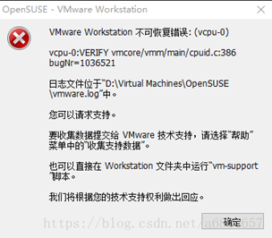

## Ubuntu环境搭建（视频版）

**解决方案：**

查看level1day1客户百度云提供的资料，有安装所需的文件和详细的安装教程，可以参考一下。链接地址左下角有课程资料地址：http://www.makeru.com.cn/video/1862.html

  


 

直接提供百度云盘连接地址：

地址：[https://pan.baidu.com/s/1QHd_uTqGgQMS8f07LN465Q#list/path=%2F](https://pan.baidu.com/s/1QHd_uTqGgQMS8f07LN465Q#list/path=/)

密码：6ejp


## ubuntu环境搭建（流程）


```
这里就是安装好，但是不太好用，我们需要再进行下一步的配置工作
1、	安装vmware tools
2、	配置vim
3、如果是18.04版本，需要安装gcc，低版本不需要  sudo apt-get install gcc
```


##  CPU虚拟化问题

**问题描述：**

在安装虚拟机时，出现vcpu-0 不可恢复性错误。

 

​    

**解决办法：**

1、重启电脑进入 BIOS方法：电脑重启开机时，按ESC 或 F2、或F5、F8或delete等..不同的品牌进入BIOS的方式不同，仅供参考，


2、进入BIOS后，找到菜单 Advanced/Intel(R) Virtualization Technology 选项设置为 Enable，保存退出；（多找找）

3、重新打开虚拟机即可。

参考链接：https://jingyan.baidu.com/article/ab0b56305f2882c15afa7dda.html

 

## Win7-32位无法安装课程提供的VMware环境问题

**问题描述：**

win 7 32位系统上安装不上vmwareworkstations，怎么办？

**解决方案：** 

1、可以更换为64位的系统，如果学生不想重装系统，可以选择下面的云盘连接： 安装vmware10的环境。

链接：https://pan.baidu.com/s/1HvLdIQ0QjH8PwEm28kyDTg 

提取码：5uwl 

2、推荐重装系统，将系统更换为win7-64位的系统（或win10系统），因为当前的很多软件和开发环境都是基于64位的系统来开发的。可以下载深度技术的系统，安装简单快捷，具有下载完后，一键重装系统的优势，不需要制作系统启动盘，

参考连接如下：http://win.51apps.com.cn/shendu.html

 

​      

 

## Vmware10和VMwareworkstation12的兼容性问题； 

镜像创建使用的是VMware Workstation12.04的版本，但是不排除某些学生用VMwareWorkstation10搭建的环境。

如果大家不是采用的我在安装所需文件\VMware Workstation 12安装+破解包 提供的VMwareWorkstation12,而是采用VMware 10的安装包，

那么你在开启提供的镜像Ubuntu-Makeru时，会遇到如下的兼容性问题，（解决方案见下面）

 


 

1、 进入解压的Ubuntu1404-32的目录下，找到Ubuntu-Makeru.vmx后缀的文件（我的是Ubuntu.vmx，一样的），


2、 右键notpad++（或记事本）打开*.vmx后缀文件

​    找到文件中的virtualHW.version = "12"字段，修改该字段为virtualHW.version = "10"；


​    保存.vmx文件，再次开启虚拟机。VMware Workstation 12创建的虚拟机可以在VMware Workstation 10.0的环境下运行。

​    （不过建议采用VMwareWorkstation12 , 好用，稳定）

参考扩展链接：https://blog.csdn.net/yumushui/article/details/45039063

 

## VMware秘钥

问题描述：

老师，VMware有没有破解的秘钥？

解决方案：

课程内提供的环境提供了注册机


 

非课程内的环境可以在网上搜索相关版本的秘钥就可以；


## Ubuntu关机命令

linux下常用的关机命令有：shutdown、halt、poweroff、init；

重启命令有：reboot。

下面本文就主要介绍一些常用的关机命令以及各种关机命令之间的区别和具体用法。

**关机命令：**

```
1、halt 立刻关机 
 2、poweroff 立刻关机 
 3、shutdown -h now 立刻关机(root用户使用) 
 4、shutdown -h 10 10分钟后自动关机 如果是通过shutdown命令设置关机的话，可以用shutdown -c命令取消重启
```

**重启命令：**

```
1、reboot 
 2、shutdown -r now 立刻重启(root用户使用) 
 3、shutdown -r 10 过10分钟自动重启(root用户使用) 
 4、shutdown -r 20:35 在时间为20:35时候重启(root用户使用) 如果是通过shutdown命令设置重启的话，可以用shutdown -c命令取消重启
```

**shutdown** **安全的关机命令**

```
对于shutdown命令，它是大家都推荐的一个安全的命令，通过参数-h或-r的配合来完成关机或重启。不过在linux系统中只有拥有root权限才可以使用这个命令。
所以，虽然大家都推荐用这个命令，但是这个命令用起来真的不太方便：想要用这个命令吗？先去获得root权限吧。
shutdown执行关机，是送信号给init，要求它改变运行级别，以此来关机。关机或重启实际上是运行级别的调整，所以我们也可以用init直接调整运行级别来进行关机或重启。使用这个命令时，机器立即关机或重启。它也需要root权限。
那么为什么说shutdown命令是安全地将系统关机呢？
实际中有些用户会使用直接断掉电源的方式来关闭linux，这是十分危险的。因为linux与windows不同，其后台运行着许多进程，所以强制关机可能会导致进程的数据丢失使系统处于不稳定的状态。甚至在有的系统中会损坏硬件设备。而在系统关机前使用shutdown命令，系统管理员会通知所有登录的用户系统将要关闭。并且login指令会被冻结，即新的用户不能再登录。直接关机或者延迟一定的时间才关机都是可能的，还有可能是重启。这是由所有进程〔process〕都会收到系统所送达的信号〔signal〕决定的。
shutdown执行它的工作是送信号〔signal〕给init程序，要求它改变 runlevel。
runlevel 0 被用来停机〔halt〕，runlevel 6 是用来重新激活〔reboot〕系统，而 runlevel 1则是被用来让系统进入管理工作可以进行的状态，这是预设的。
假定没有-h也没有-r参数给shutdown。
要想了解在停机〔halt〕或者重新开机〔reboot〕过程中做了哪些动作？
你可以在这个文件/etc/inittab里看到这些runlevels相关的资料。
```

**shutdown** **参数说明:**

```
[-t] 在改变到其它runlevel之前，告诉init多久以后关机。 
[-r] 重启计算器。 
[-k] 并不真正关机，只是送警告信号给每位登录者〔login〕。 
[-h] 关机后关闭电源〔halt〕。 
[-n] 不用init而是自己来关机。不鼓励使用这个选项，而且该选项所产生的后果往往不总是你所预期得到的。 
[-c] cancel current process取消目前正在执行的关机程序。所以这个选项当然没有时间参数，但是可以输入一个用来解释的讯息，而这信息将会送到每位使用者。 
[-f] 在重启计算器〔reboot〕时忽略fsck。 
[-F] 在重启计算器〔reboot〕时强迫fsck。 
[-time] 设定关机〔shutdown〕前的时间。 　 　　 
2.halt 最简单的关机命令用halt命令来关机时，
实际调用的是shutdown -h。halt 执行时将杀死应用进程，
执行sync系统调用文件系统写操作完成后就会停止内核。
```

**halt** **参数说明:**

```
[-n] 防止sync系统调用，它用在用fsck修补根分区之后，以阻止内核用老版本的超级块〔superblock〕覆盖修补过的超级块。 [-w] 并不是真正的重启或关机，只是写wtmp〔/var/log/wtmp〕纪录。
[-d] 不写wtmp纪录〔已包含在选项[-n]中〕。 
[-f] 没有调用shutdown而强制关机或重启。 
[-i] 关机〔或重启〕前关掉所有的网络接口。 
[-p] 该选项为缺省选项。就是关机时调用poweroff。
```

**poweroff** **常用的关机命令**

```
对于poweroff，网上说它是halt命令的链接，基本用法和 halt 差不多，这里就不多说了。
```

**init**

```
init是所有进程的祖先，他是Linux系统操作中不可缺少的程序之一。它的进程号始终为1，所以发送TERM信号给init会终止所有的用户进程，守护进程等。shutdown 就是使用这种机制。init定义了8个运行级别(runlevel)，init 0为关机，init 1为重启。
```

**reboot** **重启命令**

reboot的工作过程差不多跟halt一样。不过它是引发主机重启，而halt是关机。它的参数与halt相差不 

## 常用的vi命令

```
*****插入*****：
i       从光标当前位置开始插入
a      从光标当前位置的下一个字符开始插入 
o      在光标位置的下行插入一个空行，再进行插入
O      在光标位置的上一行插入一个空行，再进行插入
I       从光标所在行的开头开始插入正文
A      从光标所在行的末尾开始插入正文
esc＝(ctrl+[)  


**文件保存与退出**：
:w      保存文件
:w <filename> : 另存为 
:w!     强制保存文件
:q      退出
:q!     强制退出
:x      等同于 :wq
ZZ    保存文件并退出

 **文件写入与打开**：
:w filename 保存文件为给出的文件名
:w! filename 强制保存文件为给出的文件名
:f filename  将当前文件重命名为filename
:r filename  插入文件内容到光标指定的位置
:e filename  编辑新文件（打开另一个文件进行编辑）
:e! 放弃对文件的修改，并加裁原始的文件内容

**复制粘贴**：
[n]x       删除从光标开始的连续n个字符
[n]dd      删除从光标开发的n行
[n]yy       复制从光标开始的n行
y$     从光标位置复制在行尾
p      粘贴
gp     粘贴
u 		撤消
U 		撤消对一行的全部操作
ctrl+r 	重做（反撤消）
. 		重复上次操作
yw 　复制一个word
yaw　复制当前单词
dw 　剪贴一个word
daw 删除当前单词
cw 　修改一个word
D 　剪贴光标到行尾
C 　修改光标到行尾
```

