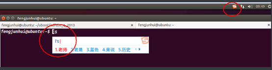

## Ubuntu下的搜狗输入法安装教程

使用 Linux 最大的烦恼就是中文输入法了，但是在 Ubuntu 下面，这都不是事！搜狗拼音已经有 Ubuntu 版本 了，所以我们照样可以使用中文输入法。

（1）在 Ubuntu 下打开搜狗输入法 Linux 版的官网（或Windows下下载然后放到Ubuntu）

 http://pinyin.sogou.com/linux/?r=pinyin，并下载你需要 的版本，这里选择 32 位版，如图所示，

​                               

选择立即下载 32bit 以后，然后选择“SaveFiles”浏览器会将 deb 安装包下载到当前用户目录的 Download 子目录下。

（2）从图形用户界面进入 Download 目录，双击下载得到的 deb 软件包，Ubuntu 会自动弹出软件管理器，然 后点击右上角的 Install，输入 root 密码即可安装搜狗输入法。

 

（3）在终端中输入 im-config，这时会出现一个对话框，点击 OK，有一个对话框，点击 Yes，你会看到下图所示对话框。

 

如果上面选中的是 fcitx，就不用管，直接关闭；如果不是，在 select 栏目下，勾选 fcitx，点击 OK 即可。又会出现一个对话框，接着就是 OK，最后重启 Ubuntu 虚拟机。

（4）重启以后在终端中输入：fcitx-config-gtk3 出现下图所示对话框。

 

点击对话框左下角的（+）按钮， 弹出另一个对话框。然后，取消 Only Show Current Language（很重要，否则不能找到刚安装过的搜狗输入法!） 最后，在输入框中输入 sogou，选中点击 OK 即可，这时候输入法列表就会多出搜狗拼音了，如下图

 

（5）关闭这些对话框，使用 ctr+空格键就可以进行 3 输入法的切换了。可以在浏览器，文本编辑器以及命令 行输入中文，其效果下图所示。

 

 