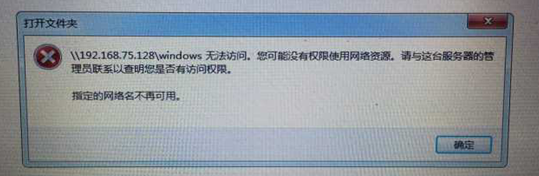
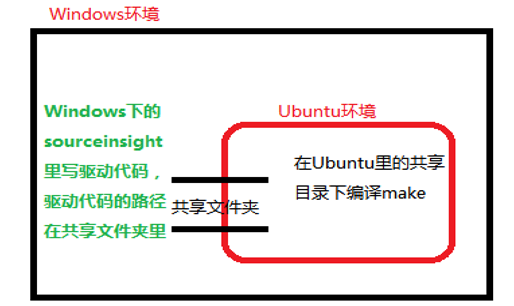
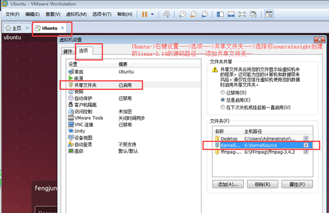

### 原理介绍：

Samba服务器经常会出现网络问题，而且错误很难排查，有时候影响你工作效率，如：

​                               

 

```
但是采用sourceinsight和共享文件夹结合的方式就可以有效的避免上述问题，共享文件夹作为Ubuntu环境和Windows环境进行文件交换的一个通道，那么我们可以尽可能的利用这个通道，比如Ubuntu下开发我们需要交叉编译环境，那么我们需要在Ubuntu下进行编译，make操作等，但是在Ubuntu里写驱动的代码又不方便，怎么办呢？可以在Windows下借助sourceinsight写驱动代码，然后将你的驱动文件的目录放到共享文件夹目录下，然后将驱动例如demodriver.c的代码拖到sourceinsight里去写驱动代码，然后在Ubuntu里直接make就可以编译这个驱动，当然了，如果觉得每次切换到共享目录比较麻烦，可以怎么做呢？哈哈，你可以通过软连接去链接到你的用户主目录下，比如ln -s /mnt/hgfs/linux-3.14/mydrivers  mydrivers ，那么每次你cd mydrivers就可以切换到共享目录下---即你Windows下的驱动目录，具体的原理图和操作见下：
```

 

 

### 5.2、操作过程：

```
搭建工程路径：	ubuntu和windows之间的桥梁
1、利用sourceinsight创建linux-3.14的内核源码工程
......
.注：在共享目录下的源码：只用于写驱动的时候追代码和写代码
	2、在 E:\KernelSource\linux-3.14下创建自己编译驱动的目录 mydrivers
			里面是你后期写的驱动
3、Ubuntu下添加一个新的共享文件夹路径 E:\KernelSource （目录下是sourceinsight创建的linux-3.14的工程）
Ubuntu-->右键设置--->选项--->共享文件夹--->选择你sourceinsight创建的linux-3.14的源码路径--->添加为共享文件夹
```



```
4、进入Ubuntu，创建软连接：
		cd  + 回车
		ln -s /mnt/hgfs/linux-3.14/mydrivers    mydrivers
5、查看路径：
	cd  + 回车
cd  mydrivers  
直接就可以进入到你windows下的自己写的驱动所对应的路径
6、测试：
在Windows下的E:\KernelSource\linux-3.14\mydrivers目录下写一个test.c，内容如下：

#include<stdio.h>
int main(int argc, const char *argv[])
{
    printf("helloworld .\n");
    return 0;
}

然后在linux下,
cd mydrivers 
进去这个目录就可以看到test.c 然后编译打印输出,查看测试结果：
gcc test.c 
./a.out 
Helloworld. 
```

