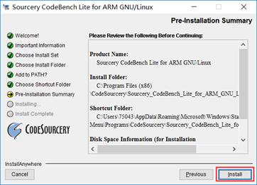
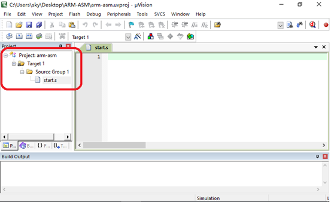

（所需安装包：https://pan.baidu.com/s/1e65CsCfJnaofzmEa05u5Iw）

### 0.1、Keil软件安装步骤

#### 0.1.1、安装Keil集成开发软件（IDE）

以管理员身份运行Keil安装包： 

如下图:

 

 

 

   

 

   

恭喜 Keil5 软件安装成功！

#### 0.1.2、安装ARM7/9等设备支持包

双击运行：    

  

 

 

 如果安装过程出现问题，呼叫老师帮你解决（或者自己百度解决）。

### 0.2、Keil 软件破解步骤

破解Keil软件，以管理员身份运行KEIL破解工具软件:  

  

 必须以管理员身份运行安装好的KEIL软件

   

打开KEIL软件后，如下图：

 

 

 

至此Keil软件破解成功！

### 0.3、在window上安装gcc编译工具

在安装编译工具链（arm-none-linux-gnueabi）之前，首先需要设置为兼容win7安装，设置步骤如下图所示：

 

选择属性之后，弹出下图对话框，按照下图所示进行相关的配置。

 

按照上图要求都设置好后，以管理员身份运行程序，

 

最终出现下图界面，选择“NEXT”即可

选中“I agree…”选项，单击“NEXT”，如下图所示：

 

选择“typical”安装，单击下一步进行安装，如下图所示：

 

选择你要将软件安装的目录，这里我们必须选择默认路径，

安装目录为：C:\Program Files (x86)\CodeSourcery\Sourcery_CodeBench_Lite_for_ARM_GNU_Linux，

 

 

等待安装结束，如下图所示：

 

   

至此已经在window上安装完成gcc编译工具。

### 0.4、Keil编译工具链配置与创建汇编工程

将Keil软件和编译工具链进行绑定之后，就可以使用Keil软件编写汇编程序。

#### 0.4.1、为Keil软件配置编译工具链

在进行绑定之前，首先要创建一个新工程，创建工程的步骤为：“Project->New uVision Project…”,如下图所示：

 

设置工程保存的路径和工程的文件名字，在这里我将工程保存到桌面的ARM-ASM文件夹下，将工程命名为arm-asm。

 

设置我们工程支持哪款CPU，这里我们选择Samsung的S3C2440A芯片

 

单击“OK”之后，弹出提示框是否导入启动文件，选择“否”：

 

建好工程后，软件界面如下图所示：

 

接下来，为此工程配置gcc编译工具，右键工程名“Target 1”，选择“Manage Project Items...”，如下图所示：

 

选择Folders/Extensions页签，将Use GCC Compiler(GNU)for ARM projects勾上 

将Prefix中的内容改成：**arm-none-linux-gnueabi-** 

将Folder: 设置编译工具链的安装路径：

C:\Program Files (x86)\CodeSourcery\Sourcery_CodeBench_Lite_for_ARM_GNU_Linux

  这样就为工程配置好了编译工具链了

#### 0.4.2、为工程配置链接脚本（map.lds）

将map.lds 复制到工程文件夹(在桌面创建的ARM-ASM文件)

​         

至此，链接脚本map.lds 配置成功

 

#### 0.4.3、为工程创建汇编文件start.s 编程调试

接下来我们需要建立一个start.s汇编文件添加到我们的工程中去

​     

在start.s文件中添加下图的编程模板后，就可以进行汇编指令集的学习了。

 

对汇编代码进行单步调试（仿真）

 

