## 检查包装是否完整

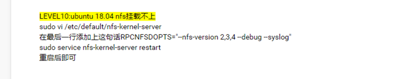

## 检查设备是否齐全

### 认识设备

FS4412开发版（包含SD卡、网线、电源线、USB转串口线）

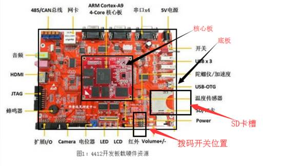


​                 **1****、SD****卡**    **2****、网线**                

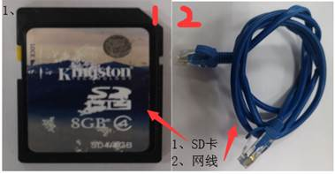  


​                 **3****、电源线**    **4****、USB****串口线**                

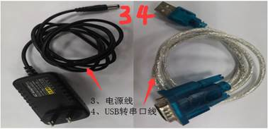


 

### 设备功能

1、SD卡：板子支持SD卡启动和emmc启动两种启动方式，**在学习阶段我们全部采用SD卡启动的方式。**

注意：插好SD卡，SD卡启动拨码开关调整至 1000，emmc启动拨码开关调整为0110。

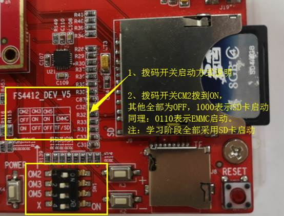

 

2、网线：用于连接FS4412开发板和Ubuntu系统（内核和设备树的网络下载速度快）

3、电源线：用于给板子供电，注意检查电源的供电电压：5V-2A，在电源适配器下面有个 OUTPUT输出 (5V===2A)。如果不匹配，注意不要给板子上电，否则容易烧坏板子。

4、USB串口线：用于FS4412开发板板子的串口信息显示，后面会讲解它的用法。

5、核心板-底板：一般板子分为核心板和底板，具体如上图所示。

## FS4412开发板上电测试

### FS4412快速接线

检查核心板位置和方向：

注意有个白色的箭头----如果收到板子之后发现由于快递导致核心板松动脱落，那么在安装的时候一定要注意核心板箭头的位置和方向，如果安装反了会烧掉板子的，如果没有脱落，则按一下核心板四周，确保没有松动。

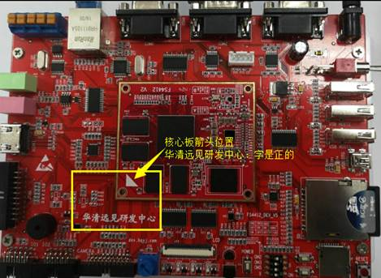

 

开发板接线示意图如下：（注意先**不要**上电）

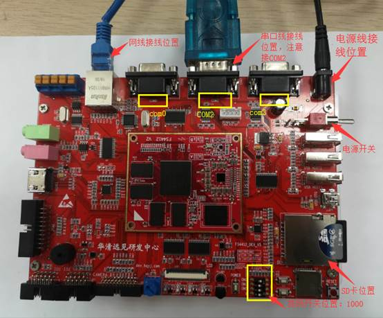

### 串口的配置

超级终端的配置

前言：

安装驱动:

进入 USB转串口驱动 目录，然后安装“CH340-USB转串口驱动” 和 “PL2303-USB转串口驱动”；----双击运行，一路next，就OK了。

（注：win10系统：右键--->管理员权限运行）

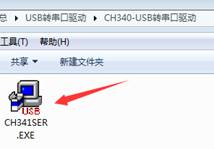

将USB串口线插到电脑的USB口上：

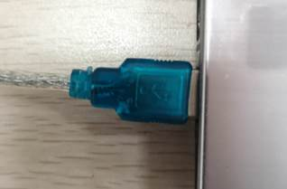

计算机--->右键点击 属性---->点击 设备管理器--->端口（COM和LPT）确保有COM口，我的是COM4,你的根据实际情况查看，如图所示；

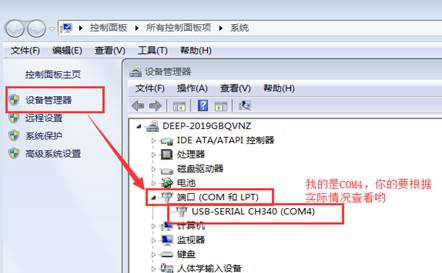

 

 

第一步：进入超级终端目录，解压对应平台的超级终端，作者电脑是win7；

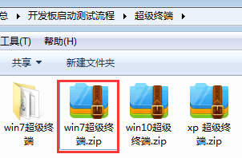

双击打开超级终端：（win10可能需要超级管理员），弹出下图界面：输入区号后，单击确定即可。

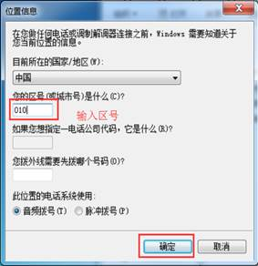

第二步：单击确定之后，弹出右上图界面，继续单击确定即可。

 

第三步：单击确定后，弹出下图界面，在下图界面中的名称处，输入新建连接的名字，单击确定

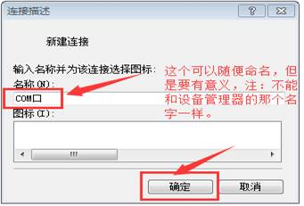

第四步：单击确定之后，弹出下图界面，选择连接使用的串口是CONn。如下图所示：

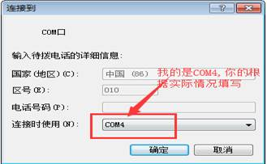

第五步：查看我么我们的串口线使用的是哪个串口，

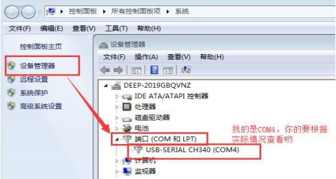

第六步：单击确定之后，弹出COM1属性的对话框，设置串口通信的数据帧格式。

位/秒（B）（波特率）：115200

数据位（D）：8  奇偶校验（P）：无  停止位（S）：1

数据流控制：无、

数据帧格式设置好后，单击确定即可，如下图所示：

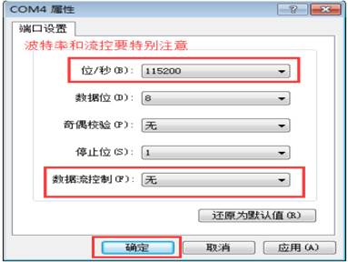

 

第七步：单击确定之后就是最后的串口打印数据的界面了，到此超级终端就配置好了，可以正常使用了。

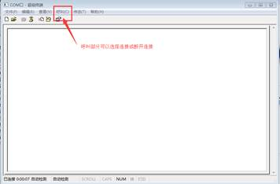

 

### 上电查看打印信息

#### 有打印信息

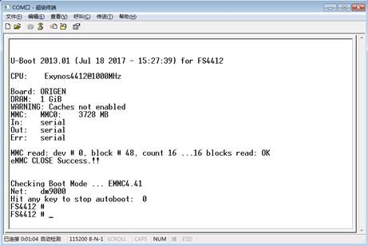

 

 

3.1.1、上电后，如果有打印信息，直接敲回车，就可以进入命令行，然后就可以开始你ARM裸机课程的学习了。

查看是否有loadb命令：

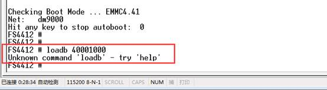

 

3.1.2、loadb命令判断

如果没有loadb命令，则更换一个uboot,见--“板子裸机测试代码目录”中的u-boot-fs4412.bin文件，烧写教程见 《 3.3.2、无打印信息》的教程。

有loadb命令，操作如下：

板子上电，然后立即在终端里敲回车，然后在终端输入如图所示 loadb 40001000，出现如图所示反应： 

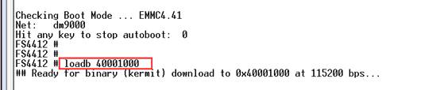

 

出现上图所示界面后，点击发送---->发送文件--->出现下图界面

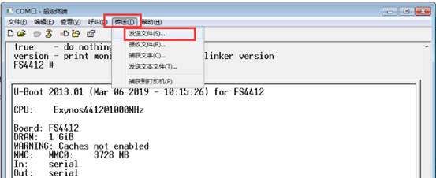

 

 

点击位置1--->浏览找到裸机测试代码fs4412test.bin文件；

点击位置2--->协议选择 Kermit 协议；

点击位置3--->发送你的裸机测试代码；

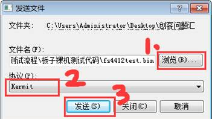

 

 

发送过程界面：

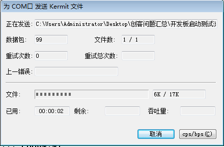

 

发送完成界面：

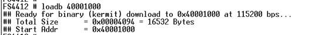

 

运行裸机程序：

 

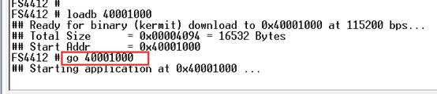

 

可以看到LED流水灯的闪烁，当然了其他硬件的测试希望你能在学过ARM裸机编程之后尽可能多的实现，继续加油。

#### 无打印信息

1、上述操作无误，则确认SD卡中的没有uboot信息，那么需要SD卡烧写。首先确认SD卡上的薄码开关处于如下图所示的位置。

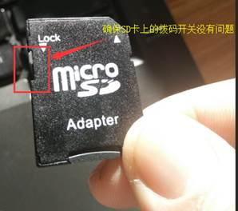

2、板子断电，将SD卡取下，插到电脑上，找一下电脑上有没有SD卡的卡槽（一般都有：如下图），如果没有，那么可能你需要购买一个读卡器了(淘宝搜下吧)。

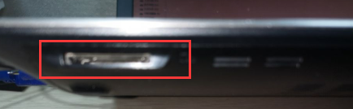

电脑识别如图所示或电脑提示你需要格式化，都是正常的现象，

选择SD卡，右键-->格式化--->开始--->格式化完成，

        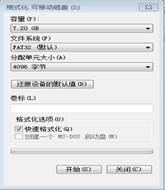

1、当格式化完毕之后就可以进行SD卡的烧写了，那么烧写分为两种方式Ubuntu下烧写（推荐）和Windows下烧写（备用）。烧写的文件存放在“SD卡烧写”目录下。

 

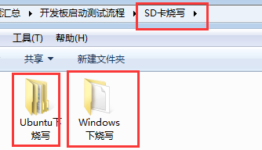

### Ubuntu下烧写，

连接SD卡到Ubuntu系统，如下图所示操作：

虚拟机--->可移动设备--->选择你的读卡器名称或SD卡名称--->连接，

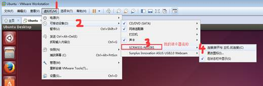

 

当连接完成之后，打开终端查看设备节点 

ls /dev/sdb ,可以看到/dev/sdb

或者通过df -h 可以查看到SD卡信息。

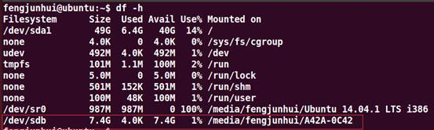

```
 
fengjunhui@ubuntu:~/uboot$ cd sdfuse_q_2013-用于uboot烧写

fengjunhui@ubuntu:~/uboot/sdfuse_q_2013$ ls

add_padding  add_sign.c Makefile    sd_fusing_exynos4x12.sh

add_padding.c chksum   mkuboot.sh   u-boot-fs4412.bin

add_sign    chksum.c  

制作uboot引导：

fengjunhui@ubuntu:~/uboot/sdfuse_q_2013$ sudo ./mkuboot.sh 

[sudo] password for fengjunhui: 

Fuse FS4412 trustzone uboot file into SD card

/dev/sdb reader is identified.

u-boot-fs4412.bin fusing...

1029+1 records in

1029+1 records out

527104 bytes (527 kB) copied, 3.49821 s, 151 kB/s

u-boot-fs4412.bin image has been fused successfully.

Eject SD card
```

 

### Windows下烧写（不建议使用）

如果Ubuntu无法识别你的SD卡，但是Windows可以，那么可以采用Windows下的uboot烧写方式：

《创客问题汇总\开发板启动测试流程\SD卡烧写\Windows下烧写》

烧写工具：ImageWriter

烧写的uboot： win-u-boot.bin

进入：ImageWriter目录：双击 Win32DiskImager.exe 打开工具。

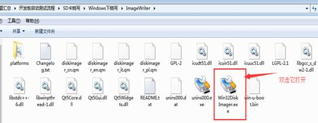

 

双击打开之后的界面如下:（如果SD卡插着的话会自动识别）

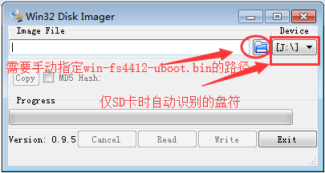

 

**（特别关注：如果你电脑接入多个U盘或SD卡的话，一定要确认这个是不是你的SD卡设备，打开计算机查看盘符：J： 千万别格式化错了哟）**

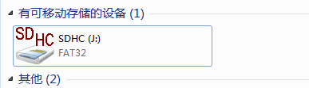

 

 

选择ImageWriter目录下的win-u-boot.bin的文件，如下图所示，然后点击打开

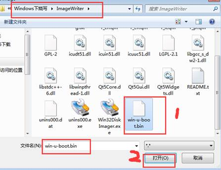

点击Write烧写win-u-boot.bin文件；

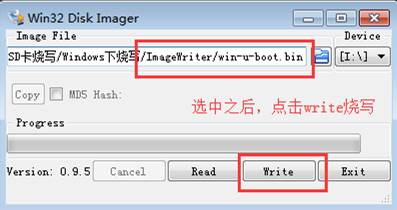

点击yes:

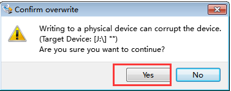

点击OK就好。

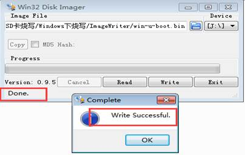

重新返回3.2，配置串口，上电查看打印信息。

### 裸机代码测试

查看过程3.3.1，加油，预祝学习愉快。

 

## FS4412开发板需要呵护

4.1、不用记得断电

4.2、远离小朋友

4.3、不能让板子游泳

4.4、搞坏需要赔付的哦

4.5、原包装寄回

 

 