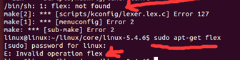
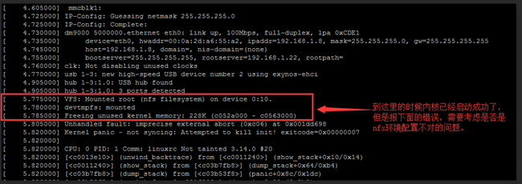
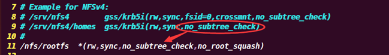
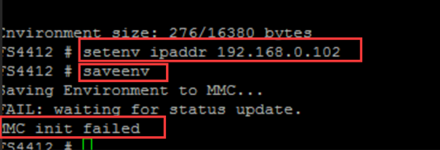

## 1、make uImage时mkimage找不到：“mkimage” commond not found -U-Boot image will not be built

**问题描述：**

                                                                          

**解决方法：**

```
sudo  apt-get install u-boot-tools（apt-get在线安装需要保持网络通畅） 
```

## 2、make menuconfig配置内核相关问题

### 2.1、找不到ncurses库Unable to find the ncurses libraries or the required header files.

**问题描述：**

```
* required header files. 
* Unable to find the ncurses libraries or the 
* required header files. 
* ‘make menuconfig’ requires the ncurses libraries. 
* Install ncurses (ncurses-devel) and try again. 
make[1]: * [scripts/kconfig/dochecklxdialog] Error 1 
make: * [menuconfig] Error 2
```

**问题原因及解决方法**：

```
Ubuntu默认是没有装这个库的
sudo apt-get install libncurses5-dev
```

### 2.2、没有bio.h文件或目录fatal error: openssl/bio.h: No such file or directory

**问题描述：**

```
scripts/extract-cert.c:21:10:  fatal error: openssl/bio.h: No such file or directory   
#include <openssl/bio.h>       
^~~~~~~~~~~~~~~  
compilation  terminated.  
scripts/Makefile.host:107:  recipe for target 'scripts/extract-cert' failed  
make[1]:  *** [scripts/extract-cert] Error 1  
Makefile:1097:  recipe for target 'scripts' failed  
make:  *** [scripts] Error 2  
```

**问题原因及解决方法**：

```
 Ubuntu默认没有装这个库，libssl-dev～没有安装  
 libssl-dev包含libraries, header files and manpages，是openssl的一部分     
 sudo  apt-get install libssl-dev  
```


### 2.3、flex找不到：/bin/sh: 1: flex not found



**解决方法：**

```
 sudo  apt-get install flex  
```

## 3、交叉编译工具链名字不一样：arm-cortex_a8-linux-gnueab-gcc

**问题描述：**

```
 视频看到的是arm-cortex_a8-linux-gnueab-gcc，资料里找不到  
```

**解决方案；**

```
 其实本质上是 gcc-4.6.4.tar.xz, 两个是通用的，没有任何版本的兼容问题，请放心使用。  
```


## 4、/bash/... path/arm-none-linux-gnueabi-gcc not found

**解决方案：**

```
 Ubuntu14.04 16.04. 64位系统的安装需要先安装如下两个包：  
 sudo  apt-get install lib32z1 lib32ncurses5  
```

## 5、uboot编译出错问题：make: *** [spl/u-boot-spl.bin] Error 2

**问题描述：**

```
/home/fengjunhui/uboot/u-boot-2013.01-fs4412/tools/mkfs4412spl:  1: /home/fengjunhui/uboot/u-boot-2013.01-fs4412/tools/mkfs4412spl: Syntax  error: "(" unexpected  
make[1]:  *** [/home/fengjunhui/uboot/u-boot-2013.01-fs4412/spl/fs4412-spl.bin] Error 2  
make[1]:  Leaving directory `/home/fengjunhui/uboot/u-boot-2013.01-fs4412/spl'  
make:  *** [spl/u-boot-spl.bin] Error 2  
```

**解决方案：** 

```
  [spl/u-boot-spl.bin]  Error 2 这个spl.bin的错误不影响uboot的使用。  
```

## 6、Start Kernel 内核起不来（最新的解决办法是更换最新的uboot）

**问题描述：**

  tftp和nfs没有问题，但是在加载内核的时候停在start_kernel 。。。。。  

**解决方案：**

```c
如果是自己编译的内核，那么按照如下步骤修改:  
打开设备树，  
vi  arch/arm/boot/dts/exynos4412-fs4412.dts,找到firmware的节点，然后将他注释掉，再试一下,  
修改：  
firmware@0203F000  {    
compatible =  "samsung,secure-firmware";    
reg = <0x0203F000 0x1000>;  
};  
为：  
/* 
firmware@0203F000 {    
compatible =  "samsung,secure-firmware";    
reg = <0x0203F000 0x1000>; 
}; 
*/  
为什么要注释掉这段代码，有的时候需要，有的时候不需要，和uboot相关需要添加备注： firmware是三星的一个固件的设备信息，因为找不到固件，所以内核启动不成功。这个不影响后期的学习，所以不需要纠结这个问题。  
make dtbs  拷贝设备树     
之前的处理办法，现在处理办法是更换最新的uboot就好 直接把最新“镜像”压缩包中的文件替换一下就行，里面的uboot包治百病，保存不了环境变量、卡在start kernel、都需要更换此压缩包中的uboot。 
 (uboot.bin镜像设备树链接：https://pan.baidu.com/s/1mGLyX1hVpnxxyyrI3acWsA)   
```

​     

## 7、文件系统挂不上kernel panic – not syncing：Attempted to kill init！exiteade

**问题描述：**

```
 如果能够执行到如下步骤，则说明内核已经成功启动了，但是随即又报下图所示的问题，那么则需要考虑是否是nfs服务器的配置问题，具体参考如下:  
 [  1.810000] clk: Not disabling unused clocks  
 [  3.010000] VFS: Mounted root (nfs filesystem) on device 0:10.  
 [ 3.015000]  devtmpfs: mounted  
 [  3.020000] Freeing unused kernel memory: 228K (c050d000 - c0546000)           
```

 

**解决方案：**

  1、检查环境变量    printenv    

     

1.1、确保nfsroot 的ip地址是你Ubuntu板子上的ip地址，在Ubuntu上可以通过ifconfig来查看是否和pri打印出的一样。  1.2、可以适当的在启动参数的位置添加 clk_ignore_unused   

1.3、查看rootfs的路径是否正确： 你的nfs路径可能是/source/rootfs或 /nfs/rootfs，

具体的查看你的nfs配置文件: /etc/exports        

sudo vi /etc/exports   课程内**的nfs配置文件信息如下，            


但是老师的内核的配置和咱们的内核配置稍微有点不同，所以需要适当的修改/etc/exports文件， 

 添加 no_subtree_check参数，  

改为如下内容；    sudo vi /etc/exports (注意你的nfs路径)    

     

然后重启开发板，就OK了  

 

## 8、uboot的环境变量EMMC无法保存（最新的解决办法是更换最新的uboot）

 (uboot.bin镜像设备树链接：https://pan.baidu.com/s/1mGLyX1hVpnxxyyrI3acWsA) 

**问题描述：**    

 

**解决方案：**

  超级终端执行env default –a  如果还是不行的话  更换最新的uboot）         

 

## 9、tftp 41000000作用

 **问题描述**


**解决方案：**

  通过tftp服务器将内核还有设备树文件下载到指定的内存地址中，然后启动内核，内核再去加载设备树，展开设备树，找到节点，访问节点中的数据(硬件信息)。  4100000  4200000这些是内存地址，指定了内存中起始地址。就是门牌号。就像之前ARM视频里那样，将代码放在指定地址。  

## 10、加载内核的时候总是显示超时打印TTTTTTTTT-加载‘uImage’超时

**问题描述：**

  Loading:T  T T T T T T T T T T T T T T T T T T T T T T T T T T T T T T T T T T  

**问题解决：** 

**TFTP服务器的安装和测试**

  (uboot.bin镜像设备树链接：https://pan.baidu.com/s/1mGLyX1hVpnxxyyrI3acWsA) 

```
 1.运行下面的命令安装TFTP服务器和客户端。  
 $ sudo apt-get install tftpd-hpa tftp-hpa**  
 $  sudo vi /etc/default/tftpd-hpa //修改tftp服务器配置文件为                
 		TFTP_USERNAME="tftp"                
 		TFTP_DIRECTORY="/tftpboot"                
 		TFTP_ADDRESS="0.0.0.0:69"                
 		TFTP_OPTIONS="-c -s   -l"         
 $ mkdir /tftpboot   //创建tftpboot目录，         
 $ sudo chmod a+w   /tftpboot  //---准备待传输文件         
 拷贝 第一天_环境搭建里面里的 u-boot-fs4412.bin uImage exynos4412-fs4412.dtb 到 /tftpboot 目录下【这个地方的三个文件用群里值班老师发的压缩包里面的】     
 2.运行下面的命令，重启TFTP服务器。  
 $ **sudo service tftpd-hpa restart**  
 【到这一步其实tftp就完成了，测试操作也可以省略】  
```

​                    

**NFS服务器的安装和测试**

```
  1. 运行下面的命令安装NFS服务器。  
  $ sudo apt-get install  nfs-kernel-server**  
  2. 运行下面的命令，创建一个目录，并在该文件下创建一个文件。  
  $  sudo mkdir /nfs  
  $  sudo chown farsight /nfs      # 非root用户需要执行该步骤，farsight为用户名  
  $  sudo chgrp farsight /nfs       # 非root用户需要执行该步骤，farsight为用户组  
  $  mkdir /nfs/rootfs  
  $  echo "nfs test" > /nfs/rootfs/test.txt  
  3. 编辑/etc/exports配置文件。  
  $  sudo vim /etc/exports  添加如下内容：  
  /nfs/rootfs *(rw,sync,no_subtree_check,no_root_squash)  
  其中：  
  /nfs/rootfs：共享的目录；  
  *：不限定客户端；  
  rw：共享目录可读可写；  
  sync：将数据同步写入内存缓冲区与磁盘中，效率低，但可以保证数据的一致性；  
  no_subtree_check  ：即使输出目录是一个子目录，nfs服务器也不检查其父目录的权限，这样可以提高效率；     	  
  no_root_squash：来访的root用户保持root帐号权限；  
  4.使用下面的命令，重启NFS服务。
  $ sudo service nfs-kernel-server  restart 
  【到这一步其实nfs就完成了,下面测试操作也可以省略， **接下来直接制作SD卡启动盘**】  
```

 

**制作启动SD卡**

```
1.将“案例源码\第一天\程序源码\sdtool”整个文件夹拷贝到Ubuntu虚拟机中的一个目录中。  
2.在Ubuntu中打开一个终端，并进入到sdtool目录。  
$ cd sdtool/  
3.将SD卡插入USB读卡器中，将读卡器插入PC机，使用前面的方法将SD卡连接到虚拟机中。  
4.在终端中执行下面的命令烧写SD卡。  
$ sudo ./sdtool.sh fuse   /dev/sdb u-boot-fs4412.bin 
---------------------------------------  【这个地方的.bin文件用群里值班老师发的压缩包里面的】  
U-Boot fusing  
766+1 records in  
766+1 records out  
392244 bytes (392 kB) copied, 4.70365 s, 83.4  kB/s  
---------------------------------------  
Image is fused successfully.  
Eject SD card and insert it again.  
上面的/dev/sdb是SD卡设备，要根据自己的实际情况决定，最好不要连接U盘等其他USB外设，否则可能会将镜像烧写在U盘上！！！     
```

 

**设置板子环境变量**

  SD卡模式启动超级终端，然后pri打印环境变量查看：设置成如图模式

        

```
 设置环境变量：  
 FS4412#  setenv serverip 192.168.1.200          虚拟机/ubuntu IP  
 FS4412#  setenv ipaddr 192.168.1.100            开发板IP         
 setenv gatewayip  192.168.1.1                   网关  
 FS4412#    setenv  bootargs root=/dev/nfs nfsroot=192.168.1.200:/nfs/rootfs rw  console=ttySAC2,115200 clk_ignore_unused init=/linuxrc ip=192.168.1.100  FS4412  
 # saveenv                                       保存环境变量  
 环境搭建全部结束，板子以SD卡启动（1000）上电不敲回车，一直执行程序直到挂载成功。  
```

 

## 11、如何把SD卡中的u-boot烧录到EMMc中（SD卡不太好用的时候也可以这样用）

**解决方法：**

```
 在超级终端执行  
 #emmc  open 0  
 #tftp  41000000 u-boot-fs4412.bin  
 #mmc  write 0 41000000 0 0x440  
 #emmc  close 0  
```

 

## 12、U-Boot DM9000网卡驱动提示"could not establish link"

**问题描述：**

​         

**问题解决：**

```c
 （1）-首先要注意自己的操作流程，操作命令以及输入法，一定是英文输入法  
 （2）-如果输入法和操作流程都没有问题那就屏蔽dm9000x.c中的一段代码，然后再编译出来u-boot-2013.bin文件进行操作。  
 static  int **dm9000_init**(struct eth_device *dev, bd_t *bd)   
 {     // 不做修改      
 #if 0   
 // 屏蔽掉这段代码     
     i = 0;     
     while  (!(dm9000_phy_read(1) & 0x20)) {  /*  autonegation complete bit */       
         udelay(1000);       
         i++;       
         if (i == 10000) {        
             printf**("could  not establish link\n");         
             return 0;       
         }     
     }   
     #endif        
     // 不做修改   
 }  
```

 

 

 