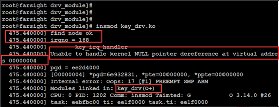
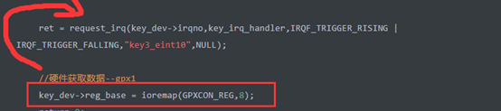
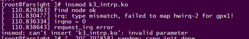
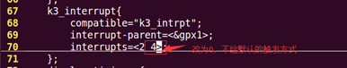
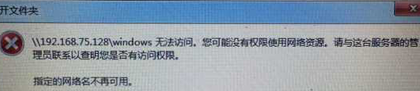
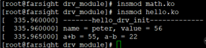
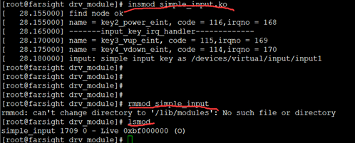
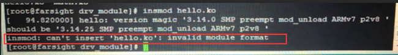
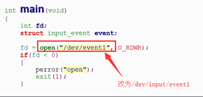
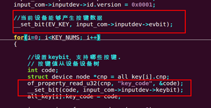

## 1、按键驱动当中的空指针异常问题：Unable to handle kernel NULL pointer

**问题描述：**



**解决方案：**

1、如果irqno = 0 ，说明驱动和设备树当中的设备节点没有匹配上，需要你检查设备树的路径问题，保证路径是一样的：

驱动代码：

```c
 // 获取到设备树中到节点
    struct device_node *np = of_find_node_by_path("/key_int_node");
```

设备树信息： 

```c
key_int_node{
        compatible = "test_key";
        interrupt-parent = <&gpx1>;
        interrupts = <2 4>;
};
```

2、如果irqno = 168,则查找到了设备节点，那么继续往下看：

原因分析：地址映射出问题了，装载模块失败，提示空指针异常的问题

查看驱动代码；

```c
#define GPXCON_REG 0x11000c20
```

中断处理函数：

```c
irqreturn_t key_irq_handler(int irqno, void *devid)
{
    //printk("-------%s-------------\n", __FUNCTION__);
    //读取数据寄存器
    int value = readl(key_dev->reg_base + 4) & (1<<2); //注意，这里操作到了虚拟地址
    ......
    return IRQ_HANDLED;
}
```

模块的加载函数：

```c
static int __init key_drv_init(void)
{
    //获取中断号
    int ret;
    ......
    //硬件初始化--地址映射或者中断申请
    key_dev->irqno = get_irqno_from_node();
    ret = request_irq(key_dev->irqno,key_irq_handler,IRQF_TRIGGER_RISING | IRQF_TRIGGER_FALLING,"key3_eint10",NULL);
    //硬件获取数据--gpx1
    key_dev->reg_base = ioremap(GPXCON_REG,8);  
    return 0;
}
```

**问题解决：**将 ioremap 相关的放到 request_irq 之前。



**原因分析：**

```c
request_irq 注册中断的方式是 IRQF_TRIGGER_RISING | IRQF_TRIGGER_FALLING 表示上升沿和下降沿都可以触发，而板子上的key按键默认会生成一个高电平，在你的驱动注册到内核的时候回触发中断处理函数key_irq_handler，
在中断处理函数中调用了 readl(key_dev->reg_base + 4) & (1<<2); 
操作了key_dev->reg_base这个虚拟地址，而这时候 key_dev->reg_base 这个地址还没有映射。所以需要将 ioremap 相关的放到 request_irq 之前。
```

## 2、新版内核问题:：irq:type mismatch, failed tomap hwirq-2 for gpxl

**问题描述：**

在中断程序中可以成功加载中断。但是rmmod之后再inmod会有报错。



**问题解决·：**

新版内核问题，把interrupts=<2 4>这里的4改为0就行了



## 3、Ubuntu samba配置

(Samba很不稳定，建议使用sourceinsight替换)

### 3.1、安装和卸载samba命令：

```
sudo apt-get install samba samba-common
sudo apt-get autoremove samba
```

### 3.2、建立samba访问目录,并且增加目录的权限

```
mkdir /home/myshare  
chmod 777 /home/myshare
```

### 3.3、samba服务添加用户（假设我的ubuntu用户名为：test）

```
sudo smbpasswd  -a   test  （输入访问Samba的密码）
```

### 3.4、配置smb.conf

```
sudo vi /etc/samba/smb.conf
在文件最后添加
[myshare ]
comment=This is samba dir
path=/home/myshare  
create mask=0777
directory mask=0777
writeable = yes
valid users = test
browseable = yes
Public = yes

path为你上面建立的共享目录/home/myshare  ，
valid users为你访问Samba的用户test
其他条件写读和创建文件及文件夹的权限
```

### 3.5、启动、停止、重启Samba服务：

```
启动Samba服务器只需执行如下命令：
sudo /etc/init.d/samba start
关闭Samba服务器：
sudo /etc/init.d/samba stop
重启Samba服务
sudo /etc/init.d/smbd restart   或者  sudo service smbd restart 
注：修改了smb.conf配置文件，需要重启Samba服务才生效
```

### 3.6、windows下访问共享目录：

```
Win+R或者点击运行，输入\\192.168.0.10\myshare  
输入你ubuntu的用户名和访问Samba的密码，就能访问共享目录myshare了。
```

## 4、Samba服务器更换为共享文件夹的说明：

**问题描述：**

1、Samba服务器不会搭建。   2、Samba服务器网络连接不上,



**解决方案：**

《6_Samba服务器更换为sourceinsight+共享文件夹教程》

## 5、Hello.ko模块加载不成功

**问题描述：**

​                                                                          

**解决方案：**

```
对于有依赖的模块的加载，需要先阿加载依赖，再加载模块，卸载的时候先卸载模块，再卸载依赖  
insmod math.ko  
insmode  hello.ko  
```

## 8、加载simple_input.ko之后remmod失败

**问题描述：**

​         

**目前解决办法：**

```
这个是默认路径，因为没有这个路径需要手动创建，需要在创建后也生成内核版本路径，所以命令如下： 
mkdir -p /lib/modules/`uname -r` ，
然后重insmod，把产生的xx.ko模块放进去，再卸载试试。
也可以尝试修改这个路径。 
在开发版的 lib/modules 下创建一个3.14.0文件夹。
把.ko拉进去然后按照流程insmod remosd。  
```

 

## 9、insmod invalid module format

**问题描述：**

​         

**解决方案：**

```
原因：内核不匹配或没有交叉编译   
1、推荐使用课程内提供的Linux-3.14.0的内核源码，    
2、如果是直接拿过来的课程内的模块去加载，想一下你的Ubuntu是不是64位系统，
如果是 ，则需要你重新编译下你的驱动源码：修改Makefile的源码路径（指定你自己的），
然后重新拷贝加载。   
3、模块需要交叉编译，可以在Ubuntu上用 file 命令查看模块的格式,确保是ARM格式。    
@ubuntu:/mnt$  file demo.ko   
demo.ko:  ELF 32-bit LSB relocatable, ARM, EABI5 version 1 (SYSV),
BuildID[sha1]=a68ea388e9d977dd872d79461a7ecfc2b4f787dd,  not stripped  
```

## 10、input子系统设备节点找不到：

**问题描述：**

  课程内的应用程序写的设备节点为 /dev/event1，但是并不是这个节点。 

                                                                         

**解决方案：**

```
如果驱动没有问题，可以通过 ls /dev/input/event* 命令看到对应的设备节点信息     
root@makeru:~$  ls /dev/input/event*  
/dev/input/event0  /dev/input/event1     
修改/dev/event1 为 /dev/input/event1  
(注： 根据你的驱动生成的实际的设备节点名填写，我的是event1)  
```

## 11、input子系统上报按键信息读不到问题：

**问题描述：**

```
输入子系统，按键无任何现象。Input子系统的应用层读不到驱动上报的按键信息，按键之后应用层没反应  
```

**解决方案：**

  事件的类型和事件的值设置的不对；         

 

## 12、Linux驱动卸载时出现“Device 'xxx' does not have a release() 

**问题描述：**

```
Linux驱动卸载时出现“Device 'xxx' does not have a release() function, it is broken and must be fixed”
```


**问题解决：**

```
在用platform bus方法编写Linux内核驱动模块时，在模块卸载过程中，如果系统出现提示“Device 'xxx' does not have a release() function, it is broken and must be fixed.” 说明系统在卸载是找不到release()函数，这个函数对应在结构体struct platform_device中的成员struct device中的void    (*release)(struct device *dev)方法。
所以只需要在代码中增加一个release方法，并且注册到struct device成员中就可以了。比如：
在代码中定义static void platform_device_test_release(struct device *dev);
在struct platform_device结构体定义添加release函数注册：
static struct platform_device test_dev =
{
      .name = DEV_NAME,
      .id   = 0,
      .num_resources = 1,
      .resource = serial_test_resource,
      .dev = {
          .release = platform_device_test_release,
      }
};
这样，驱动模块卸载时，就不会出现以上的错误了。
```

