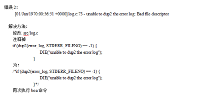

 

**项目期间推荐学习网站：https://blog.csdn.net/feit2417/article/details/84936557 **

## 1、 GPRS设备问题：

```
没有GPRS模块 ---- GPRS的课程作为学习内容仅用于扩展视野，不提供设备。掌握GPRS的原理和使用的流程就可以了，以后工作当中遇到这个模块可以快速上手开发。  
```

## 2、Zigbee环境问题：

### 2.1、ZigBee环境跑课程内的代码跑不通

**解决方案：**

```
 ---  严格根据ZigBee实验手册和课程的资料搭建肯定没有问题；  
 1、ZigBee协议栈一定要用课程内提供的（注意版本问题---自己下载的版本跑不通）；  
 2、Win10系统必须右键管理员安装运行；  
```

### 2.2、ZigBee设备的原理图在哪里啊？

**解决方案：**

  资料里提供了，让他找资料里的《ZigBee部分资料\05原理图部分》                                                                          

 

## 3、文件权限管理的问题

**问题描述：**

  学员在做到项目环节的时候，对文件的操作权限认识不足。  简单认为权限不足，加sudo就能解决，但是发现环境变量又找不到了，尤其是交叉编译的时候  arm-none-gnueabi-gcc 找不到，这个时候需要注意了，你可能并不需要加sudo,

​                

**解决方案：** 

```
1、 ls -la 查看当前目录所属用户和用户组  
如果如上图所示，可以切换到当前文件夹对应的/home/linux用户目录，执行如下命令：  
sudo chown linux:linux mjpg-streamer-code-182 -R  
这样这个文件夹下的文件就不再是root用户的了，而是当前用户的。你再次进行操作的时候应该不需要加sudo了。  
2、如果遇到那种首先ls -la filename 查看具体的文件  如果文件的确缺少权限的话，
可以通过chmod 777 filename ，去添加权限，具体添加为什么权限，根据你实际情况就好，
如果对权限部分认识不足的话，那么回去看一下level1部分的笔记，权限管理很重要。  
3、 如果的确需要用到sudo ,那么理清楚sudo su 和sudo的区别，见如下；  
sudo  : 暂时切换到超级用户模式以执行超级用户权限，提示输入密码时该密码为当前用户的密码，
而不是超级账户的密码。不过有时间限制，Ubuntu默认为一次时长15分钟。  
4、  sudo  su ：  切换到某某用户模式，提示输入密码时该密码为切换后账户的密码，
用法为“su 账户名称”。如果后面不加账户时系统默认为root账户，密码也为超级账户的密码。没有时间限制。  
sudo  -i: 为了频繁的执行某些只有超级用户才能执行的权限，而不用每次输入密码，可以使用该命令。
提示输入密码时该密码为当前账户的密码。没有时间限制。
执行该命令后提示符变为“#”而不是“$”。想退回普通账户时可以执行“exit”或“logout” 。     
sudo  -i 直接运行sudo命令加-i参数  
sudo  su 运行sudo命令给su命令提权，运行su命令。  
sudo  -i 运行结果 PWD=/root  s
udo  su 运行结果 PWD=/home/用户名（当前用户主目录）  
```

## 4、视频流卡顿问题

**问题描述：**

  视频流服务器移植OK之后，在网页端显示如下图：   

                                                                       

**解决方案：**

  本质上的原因是因为摄像头的质量稍微差一点，但是可以在start.sh的文件里去修改帧率和大小来调整清晰度。进入mjpg-streamer目录，

         

vi start.sh   改为320x240 帧率 -f 10就OK了，测试的结果。         

 

## 5、UNKnow command :`cohttp`://mjpg-steramer.svn.sourceforge.NET /svnroot

**问题描述：**


**问题解决：**

```
移植mjpg-streamer 
1、下载源码，在https://sourceforge.net/projects/mjpg-streamer/下载的源码(mjpg-streamer-code-182) 最新的版本使用以下命令下载， 
svn cohttps://mjpg-streamer.svn.sourceforge.NET/svnroot/mjpg-streamermjpg-streamer 
解压，并进入目录一共有 这么多目录 
doc mjpg-streamer udp_client 
mjpeg-client mjpg-streamer-experimental uvc-streamer 
mjpg-streamer ：目录下提供了 的执行程序和各个输入输出设备组件 
uvc-streamer   ： 目录下提供了 uvc-streamer的可执行目录 
mjpeg-client： ： 分别有 linux和windows 的客户端
```

## 6、mjpeg-streamer视频流移植的路径与文件格式问题

**问题描述：**

                                                                          

**解决方案：**

```
这部分虽然笔记里写的很清楚，但是很多学员在没有理解的情况下就复制粘贴，很容易导致路径错误。
编译jpeg-8b的库的时候，要指定为自己的路径，这个路径需要在后面编译mjpeg-streamer的时候用到，尤其是要添加lib和include的库。
当jpeg的库编译生成的时候，进入 /home/linux/securitymonitor/mjpeg-streamer/video/jpegarm目录下，可以看到有对应的lib路径和include路径，那么一定要进入lib目录下，通过file命令去查看库的格式，记住，你是往板子上移植，所以需要交叉编译确保库的格式是ARM格式的，否则后面就会出现下图所示错误。
```


## 7、使用摄像头出现如下信息 Init v4L2 failed !! exit fatal

**问题描述：**

```
……………….. 
Init v4L2 failed !! exit fatal 
init_VideoIn failed 
………………..
```

**问题解决：**

```
原因：市面上大部分摄像头都是支持YUV的，而不是JPEG的。 
解决方法：由于mjpg-stream支持JPEG和YUV两种格式，所以只需修改start.sh，在输入中加入 ” - y “ 
假如原来是./mjpg_streamer -i “./input_uvc.so ” -o “./output_http.so -w ./www”，则改为 
./mjpg_streamer -i “./input_uvc.so -y” -o “./output_http.so -w ./www”即可。 
总结：经过一轮的谷歌+百度后终于可以在firefox看了摄像头采集的图像
```

## 8、boa移植：无痕浏览模式-unable to dup2 the error log:Bad file esciptor

**问题描述：**根据文档里的把相应代码注释掉，再执行，仍然报这个错误 ：


**解决方案：**

先make clean 然后重新编译执行




## 9、boa移植需要修改的文件

### 9.1、boa.conf

```
Port  80  
User  0  
Group 0  
ErrorLog /boa/log/error_log  
AccessLog /boa/log/access_log   
DocumentRoot /boa/www  
UserDir public_html  
DirectoryMaker /boa/boa_indexer   //被修改
MimeTypes /boa/mime.types   //被修改
```

### 9.2、Makefile

```
每执行完一次./configure就会生成一个新的Makefile文件，需要重新修改Makefile文件中需要修改编器gcc为交叉编译工具链arm-none-linux-gnueabi-gcc
```

### 9.3、compat.h

```
修改 boa-0.94.13/src$ vi compat.h  +120
找到
#define TIMEZONE_OFFSET(foo) foo##->tm_gmtoff
修改成
#define TIMEZONE_OFFSET(foo) (foo)->tm_gmtof
```

### 9.4、boa.c

```
将boa.c中的 vi   boa.c
		225     #if 0     //注释掉
		226         if (setuid(0) != -1) {
		227             DIE("icky Linux kernel bug!");
		228         }
		229     #endif

这三行注释掉，否则boa启动时会出现“boa.c:226 - icky linux kernel bug!: No suchfile or directory错误”
```

### 9.5、boa移植中新建的文件和目录(rootfs中)共6个

```
/boa --/boa/www --/boa/cgi-bin --/boa/log
/boa/log创建access_log和error_log两个文件
```


### 9.6、boa实验流程需要移动的文件 

```
Boa :执行完make后产生的可执行文件boa
boa.conf：解压后，boa文件夹中的
boa_indexer：执行完make后产生的可执行文件boa_indexer
mime.types: ubuntu中的/etc目录下的mime.types文件
课程中提供的测试文件也要拷贝到里面，注意放到图中的目录下
pass.cgi
test.cgi
image.jpg
index.html
pass.html
```

### 9.7、在ubuntu下测试，最终生成的目录结构

**注意：测试的时候，浏览器打开为无痕浏览的模式，防止显示之前缓存的页面**


## 10、Content-type:text/html 出现乱码

**问题描述：**


**问题解决：**

```
编译的时候少了静态链接
```

