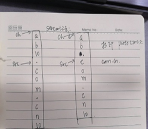

 

## 1、标点符号问题：test.c:6:2: error: expected ‘,’ or ‘;’ before ‘int’

**问题描述：**test.c:6:2: error: expected ‘,’ or ‘;’ before ‘int’

```c
#include <stdio.h>
int main(int argc, const char *argv[])
{
	int a = 10 
	int b = 5;
	
	printf("%d\n", a+b);
	return 0;
}
```

```
运行结果:
linux@linux:~/Desktop/0_stu$ gcc test.c 
test.c: In function ‘main’:
test.c:6:2: error: expected ‘,’ or ‘;’ before ‘int’
  int b = 5;
  ^
test.c:8:19: error: ‘b’ undeclared (first use in this function)
  printf("%d\n", a+b);
                   ^
test.c:8:19: note: each undeclared identifier is reported only once for each function it appears in

```

**问题解决：**

```
看提示是test.c第6行附近有错误，看源代码第6行没错，但是看第5行10后面少了一个分号。注意细心。
```


## 2、Void强制转换问题：warning: format ‘%d’ expects argument of type ‘int’,

**问题描述：**  warning:  format ‘%d’ expects argument of type ‘int’, but argument 2 has type ‘int *’  [-Wformat=]  

```C
#include <stdio.h>
int main(int argc, const char *argv[])
{
	int a = 10;
	void *q;
	q = (void *)a;
	printf("%d\n", (int*)q);
	return 0;
}

```

```
运行结果:
linux@linux:~/Desktop/0_stu$ gcc test.c 
test.c: In function ‘main’:
test.c:8:2: warning: format ‘%d’ expects argument of type ‘int’, but argument 2 has type ‘int *’ [-Wformat=]
  printf("%d\n", (int*)q);
  ^
linux@linux:~/Desktop/0_stu$ ./a.out 
10
```

**问题解析：**

```c
  **正确编写：**  
      q  = (void *)&a;  
	  printf("%d\n",  *((int *)q));  
```

**拓展讲解：**

```c
 p=(void  *)a;  
//这一句 正确的做法是  
 p=(void  *)&a;  
//否则 是把a值赋值给了p ,违背了指针类型值应为地址的原则。  
//虽然编译不会有错，但到了  s=(int*)p  这一步的时候 s并不是合法地址 打印s值为500  
void *p;    
*((int *)p)=4;与  
int a=5;  
void *p=(void *)&a; 这两条语句是完全不同的。  
int a=5;  void *p=(void *)&a; 
//这是一条合法语句，表示定义一个指针变量，并指向一个整型变量的地址。即：通过指针变量p，可以访问到变量a的数据  
void *p; 
//定义一个指针变量，未指定数据类型（void表示任意类型）,也没指定内存空间，是个野指针  
 *((int *)p)=4; 
//这句语法是合规的，但是向野指针中写入数据，会引起core dump.     
 正确写法：  
int a=5;  
void *p=(void *)&a;  
*((int *)p)=4; //这样写，相当于实现a=4  
void *p; //定义p为通用指针型变量,p可以保存char型,int型,结构体等类型数据的地址,需要进行类型的强制转换  
 *((int *)p)=4; //这里的(int *)p，是将p强制转换为保存int型数据的地址变量,最前面这个*，是对已经转换为保存int型数据的地址变量取其内容，这句的作用是地址p所指向内容为4.  
int a=5; 
void *p=(void *)&a; //&a表示取a的地址,其前面的(void*)表示将a的地址强制转换为通用的地址类型，  然后(void *)&a;这个地址赋值给通用的地址类型变量p.  前者是对*p进行赋值操作;后者是对p进行赋值操作,这个是最大的区别.  
```

## 3、数组越界问题：

### 3.1、课程例题strcat之后.com.cn没有点.输出

```c
#include <stdio.h>
#include <string.h>
int main(int argc, const char *argv[])
{
 char ch[] = {'a','b','\0'};
 char src[] = ".com.cn";
 strcat(ch, src);
 puts(src);
 puts(ch);
 return 0;
}
```

```
运行结果:
linux@linux:~$ gcc strcat.c 
linux@linux:~$ ./a.out 
com.cn
ab.com.cn
```

**问题描述：**

```
为什么打印出来的src没有点.  
```

**问题解决：**



```
反正数组ch大小没设定肯定是错的，数组越界编译器不报错；  
```

**数组越界：**

所谓的数组越界，简单地讲就是指数组下标变量的取值超过了初始定义时的大小，导致对数组元素的访问出现在数组的范围之外，这类错误也是 C 语言程序中最常见的错误之一。

在 C 语言中，数组必须是静态的。换而言之，数组的大小必须在程序运行前就确定下来。由于 C 语言并不具有类似 Java 等语言中现有的静态分析工具的功能，可以对程序中数组下标取值范围进行严格检查，一旦发现数组上溢或下溢，都会因抛出异常而终止程序。也就是说，C 语言并不检验数组边界，数组的两端都有可能越界，从而使其他变量的数据甚至程序代码被破坏。

因此，数组下标的取值范围只能预先推断一个值来确定数组的维数，而检验数组的边界是程序员的职责。

一般情况下，数组的越界错误主要包括两种：**数组下标取值越界与指向数组的指针的指向范围越界。**

### 3.2、字符数组’\0’的相关问题：

**问题描述:**

```c
#include <stdio.h>
int main(int argc, const char *argv[])
{
	char arr1[] = {'a','b','c','d'};
	char arr2[] = {'a','b','c','d','e','f'};
	printf("%s\n",arr1);
	printf("%s\n",arr2);
	return 0;
}
```

```
运行结果:
linux@linux:~ $ gcc test.c 
linux@linux:~ $ ./a.out 
abcdabcdef
abcdef
```

**问题解决：加\0的问题**

```c
//字符串输出
//碰到\0结束
char str[5] = {'h','e','l','l','o'};
//对于大括号中的字符个数和数组长度相同，系统不会自动添加'\0' 
一般要char str[6] = {'h','e','l','l','o'，‘\0’};
//字符数组不会有结尾标志，字符串型会默认补上
char a[] = "success!"; //这句后面就有'\0';
char a[] = {'s','u','c','c','e','s','s','!'}; //这句后面就不会有'\0'
```

## 4、典型的一个字符串赋值问题（Segmentation fault (core dumped)）

**问题描述：**

```c
#include <stdio.h>
#include <string.h>
int main(int argc, const char *argv[])
{
	char a[] = "asdf";
	char b[] = "gh";
	char *p = "jkl";

	printf("%s\n",strcat(a,b));
	printf("%s\n",strcat(p,strcat(a,b)));
	return 0;
}
```

```
运行结果:
linux@linux:~ $ gcc strcat.c 
linux@linux:~ $ ./a.out 
asdfgh
Segmentation fault (core dumped)
```

**解决方案：**

  第一次赋值是由于a的数组空间不足导致的 ; 第二次赋值是由于p指向的空间在字符串常亮区不可修改。  

**深入理解下图：**


## 5、段错误:Segmentation fault (core dumped)

这表示段错误，一句话来说，段错误是指访问的内存超出了系统给这个程序所设定的内存空间，例如访问了不存在的内存地址、访问了系统保护的内存地址、访问了只读的内存地址等等情况

### 5.1、开胃小菜：

#### Scanf：

```c
#include <stdio.h>
#include <stdlib.h>
int main(void){
        int i = 0;
        int n = 0;
start:
      for(i = 0;i<10;i++){  
printf("enter a number between 0 and 10:");
   //   scanf("%d",&n);
//当接收用户输入时，scanf函数中未加"&"符号，
//编译能通过，但是会出现“段错误”这样的错误提示
                 scanf("%d",n);
				if(n >10 || n < 0) {
                        goto start;
                } else if(n == 0 ) {
                        goto location0;
                } else if(n == 1) {
                        goto location1;
                } else {  goto location2;   } }
location0:
        printf("you entered %d\n",n);
        goto end;
location1:
        printf("you entered %d\n",n);
        goto end;
location2:
        printf("you entered between 2 and 10\n");
end:
        return 0;}
```

```
运行结果：
linux@linux:~/Desktop$ gcc 1_scanf.c 
1_scanf.c: In function ‘main’:
1_scanf.c:12:18: warning: format ‘%d’ expects argument of type ‘int *’, but argument 2 has type ‘int’ [-Wformat=]
                  scanf("%d",n);
                  ^
linux@linux:~/Desktop$ ./a.out 
enter a number between 0 and 10:2
Segmentation fault (core dumped)


```

**原因分析：**

```c
因为scanf这个函数要求的参数传递的是地址！！
函数原型：
int scanf(const char *format,...);
其调用形式为: 
scanf("<格式说明字符串>",<变量地址>);变量地址要求有效，并且与格式说明的次序一致。
```

### 5.2、段错误产生的原因：

#### 5.2.1_访问不存在的内存地址：

```c
#include<stdio.h>
#include<stdlib.h>
int main(int argc, const char *argv[])
{
        int *ptr = NULL;
        *ptr = 0;
        return 0;
}
```

```
运行结果：
linux@linux:~/Desktop$ gcc 2_test.c 
linux@linux:~/Desktop$ ./a.out 
Segmentation fault (core dumped)
```

#### 5.2.2_访问系统保护的内存地址

访问了不属于进程地址空间的内存

```c
#include<stdio.h>
#include<stdlib.h>
int main(int argc, const char *argv[])
{
        int *ptr = (int *)0;
        *ptr = 100;
        return 0;
}
```

```
运行结果：
linux@linux:~/Desktop$ gcc 2_test.c 
linux@linux:~/Desktop$ ./a.out 
Segmentation fault (core dumped)
```

#### 5.2.3_访问只读的内存地址

错误的访问类型引起

```c
#include<stdio.h>
#include<stdlib.h>
#include<string.h>
int main(int argc, const char *argv[])
{
        char *ptr = "test";
        strcpy(ptr, "TEST");
return 0;
}
```

```
运行结果：
linux@linux:~/Desktop$ gcc 2_test.c 
linux@linux:~/Desktop$ ./a.out 
Segmentation fault (core dumped)
```

#### 5.2.4_函数内的打印错误

```c
#include <stdio.h>
int main(int argc, const char *argv[])
{
	int a = 10;
	printf("%s\n", a);
	return 0;
}
```

```
运行结果：
linux@linux:~/Desktop$ gcc 2_test.c 
2_test.c: In function ‘main’:
2_test.c:6:2: warning: format ‘%s’ expects argument of type ‘char *’, but argument 2 has type ‘int’ [-Wformat=]
  printf("%s\n", a);
  ^
linux@linux:~/Desktop$ ./a.out 
Segmentation fault (core dumped)
```

### 5.3、Aborted (core dumped)

**问题描述：**

```c
*** stack smashing detected ***: ./a.out terminated
Aborted (core dumped)
```

**问题解决：**

在程序函数中，数组越界访问，在程序运行时没出现问题，但当函数return的时候就会出现上面的错误

```c
#include <stdio.h>
int main()
{
	char s[5];
	scanf("%s",s);
	printf("%s\n",s);
	return 0;
}
```

```
运行结果：
linux@linux:~/Desktop$ gcc 7_scanf.c 
linux@linux:~/Desktop$ ./a.out 
12345
12345
linux@linux:~/Desktop$ ./a.out 
123456
123456
*** stack smashing detected ***: ./a.out terminated
Aborted (core dumped)
数组越界
```

## 6、 union 以及 struct 定义的结构体大小：

**问题实例：**

```c
#include <stdio.h>
typedef union
{
	long i;
	int k[5];
	char c;
}DATA;
struct data{
	int cat;
	DATA cow;
	double dog;
}too;
DATA max;
```

```
运行结果（32位编译器下）：
sizeof(DATA)  =  20；
sizeof(struct data)  =  32；
sizeof(struct data) + sizeof(max)) = 52；

解析：
DATA是一个union, 变量公用空间. 
里面最大的变量类型是int k[5], 占用20个字节. 所以它的大小是20 。
data是一个struct, 每个变量分开占用空间. 
依次为int 4 + DATA 20 + double 8 = 32. 
所以结果是 20 + 32 = 52. 
当然...在某些16位编辑器下, int可能是2字节,
那么结果是 int 2 + DATA 10 + double8 = 20
```

