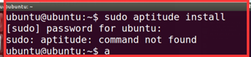
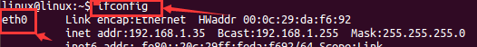
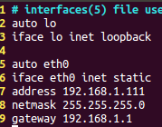
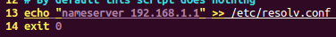
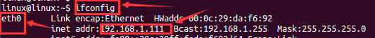
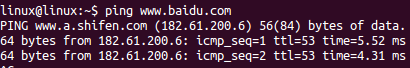

## 1、软件包管理分类命令的问题sudo:aptitude:command not found

**问题描述：**

​                                                                          

**问题解决：**

  在Ubuntu14.04的环境下，输入sudo apt 然后加tab tab按两次可以看到所有的提示命令，在Ubuntu14.04的环境下没有aptitude的这个命令，（sudo apt-get install  aptitude），课程录制所使用的环境是Ubuntu18.04，版本比较高，存在这个命令。  

 

## 2、命令行网络配置：

**（1）、首先终端输入ifconfig看看自己电脑用的网卡名字**

  （本人网卡是eth0，IP：192.168.1.35）； 注意：eth0  是阿拉伯数字零0，不是字母哦O。         

 

**（2）、终端输入：sudo vi /etc/network/interfaces开始配置网络**

  配置静态IP，然后保存退出:  在配置过程中需要提前知道自己windows的IP是多少，在此时设置的IP要和windows在同一网段。如我的windows的Ip是1网段，所以我也设置虚拟机静态IP是1网段，但是虚拟机IP和电脑·IP不能重复一样。         

 

**（3）、终端输入：sudo vi /etc/resolv.conf去配置DNS**

  在最后加入一句话：nameserver 192.168.1.1 然后保存退出。         

 

**（4）、终端输入：sudo vi /etc/rc.local 打开**

  在后面加上echo “nameserver 192.168.1.1”>> /etc/resolv.conf  exit 0 输出重定向到此文件保证每次重启网卡都是一样的，永久生效。         此时网络已配置完毕，然后关闭虚拟机重启；   

**（5）、虚拟机重启之后，终端输入：sudo /etc/init.d/networking restart 重启网卡就好了。**

​         

**（6）、最后终端输入 ping** [**www.baidu.com**](http://www.baidu.com) **测试是否能上网**

​         

 