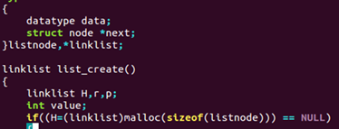
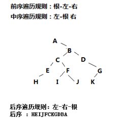

 

## 1、数据结构和数据库有什么区别：

**问题解决：**

  **数据结构**：涉及逻辑结构，存储结构，运算，一个好的数据结构，时间复杂度低，空间复杂度低，理解起来好理解。数据结构是电脑里数据的组织方式,或者说存储方式,是一种什么结构来存取数据,例如典型的堆栈结构stack,队列结构queue，链表结构list等，堆栈是后进先出Last In First Out （LIFO），队列结构是First In First Out(FIFO)，链表是任意位置插入新数据之类的，简单来说就是找一种方式方便你存取你的数据  **数据库：**数据库数据集合顾名思义库存储地方嘛即存放大量数据地方而往数据库里放数据或者访问数据库里数据方式数据结构内容了数据库相当于容器数据结构相当于往容器里放东西方式和取东西方式没有数据结构容器里东西(数据)会杂乱无章取出来也麻烦。  

 

## 2、队列创建的函数的参数为什么是二级指针？

**问题描述：** 

创建函数的参数为什么是二级指针（队列和树的代码中）----level3day7链式队列

 

```c
 头文件：linkqueue.h  
     typedef  struct linkqueue{  
         linkqueue_pnode  front,rear;  
     }link_queue,*link_pqueue;     
源文件：linkqueue.c  
    void  init_linkqueue(link_pqueue *Q)  
{    //申请front和rear的空间    
    *Q=(link_pqueue)malloc(sizeof(link_queue));    
    //申请头结点空间      
    (*Q)->front=(linkqueue_pnode)malloc(sizeof(linkqueue_node));    
    (*Q)->front->next=NULL;    
    (*Q)->rear=(*Q)->front;    
    return;  
}     
test.c文件：    
    link_pqueue q; //结构体指针变量    
	init_linkqueue(&q); //初始化的时候传递的二级指针   
```

**问题解决：**

  答案：这里重点考察函数传参过程中的地址传递，定义一个结构体指针变量（4个字节），那么在使用的候需要对结构体指针变量指向的结构体进行空间的申请和成员的初始化，我们通过这个创建函数，把开辟好的地址存放到我们的实参中，同时借助这个参数将创建好的链表或队列的头返回，比较方便，所以采用二级指针。 

**扩展：** 

  函数将返回值带回的方式：  1、通过基本数据类型取地址作为参数传递给函数来基础数据类型的数据进行初始化；  2、通过二级指针传参来对构造数据类型（比如：结构体变量）进行初始化；  3、通过函数的返回值获得返回值  

 

## 3、顺序表中的L->last = -1不理解

**问题描述**：

  对顺序表、链表中的L->last = -1 不理解。  

**问题解决：**

​                                                                         

 顺序表：具体的解释：  表里放的是我们的数据，last来标记我们最后一个元素的位置，如果一个都没有，我们让它等于-1，这样来了一个数据，我们给它+1正好是0（码农的世界里数数从0开始）。我们每次插入、删除时，last都是变化1，所以这里设置成-1；  

 

## 4、Hash查找-二次探查法·：

|  |
| ------------------------------------------------------------ |
|  |

 

**例题：**

```
设哈希表长为14，哈希函数是H(key)=key%11,表中已有数据的关键字为15，38，61，84共四个，现要将关键字为49的结点加到表中，用二次探测再散列法解决冲突，则放入的位置是( ) 【南京理工大学 2001 一、15 （1.5分）】  
A．8 B．3 C．5 D．9  
答案为D,   
计算步骤如下:  
15，38，61，84用哈希函数H(key)=key%11计算后得地址:4,5,6,7  
49计算后为5,发生冲突.  
二次探测再散列法解决冲突:  
1:(key+1^2)%11=(49+1)%11=6,仍然发生冲突.  
2:(key-1^2)%11=(49-1)%11=4,仍然发生冲突.  
3:(key+2^2)%11=(49+4)%11=9,不再发生冲突.  
得出结果为D  
```

 

**拓展：什么是二次探查法：**

         

数据结构中的二次探查法题目，解决办法附件图（题目需要的探查因子需要是整数，所以不使用浮点数的增长值）  

## 5、创建链表申请空间问题

**问题描述：**

  创建空链表时这个地方申请空间为什么sizeof（listnode）为什么是求listnode的大小，不应该是list H么 

        

**问题解决：**

  因为每个链表创建的时候是给其每个节点分配了堆中的内存，则在程序结束前释放  链表和顺序表不一样，顺序表是连续空间一起申请  链表每个节点单独空间  

 

## 6、树和二叉树前中后遍历：

**问题描述：**

  已知遍历结果如下，试画出对应的二叉树：  

前序：ABCEHFIJDGK  

中序：AHECIFJBDKG  

**问题解决：**

  遍历是有三个遍历方法的，每个都有规律，

前序：根-左-右，中序：左-根-右，后序：左-右-根，

这个规律同样适用遍历后观察规律，  前序第一个一定是树的根节点， 后序同理，那么就可以根据第一根分中序的左右子树，子树里也用这个前序后续规律找就可以还原。  

前序遍历规则：根-左-右  

中序遍历规则：左-根-右  

 后序遍历规则：左-右-根  



后序：H E I J F C K G D B A  

## 8、error: unknown type name ‘blistnode’blistnode *H,*r,*p;

**问题描述：**

  找不到文件中某个单词，但是记得自己好像是都声明过了，为什么还会unknown呢？         

 

**问题解决：**

  看错误提醒的文件名以及行号打开对应文件：名字一定要拼写正确不要犯这种小错误哦；

       

## 9、error: unknown type name ‘seq_pqueue’

**问题描述：**

  很多个函数找不到。         

 

**问题解决：**

  这个是他找不到某个东西，现在是多个函数找不到，大多是头文件的原因：1、头文件是否包含；2、ifndef时候否写成了ifdef。如果是一个函数找不到，大多可能的原因是我们函数的定义，实现，调用三个地方，自己不小心写错了字母或者符号，要细心。  