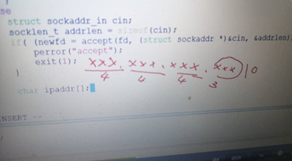
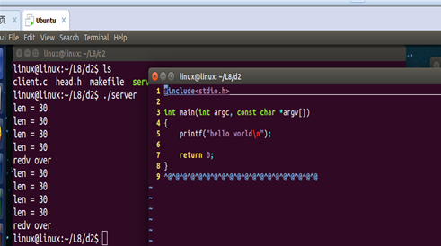

## 1、IPV4网络IP地址的主机地址为什么是三个字节

**问题解决：**



  将网络字节序IP转化成点分十进制IP为什么后面那个占三个字节。他把ip地址子字符串的形式输出，原来每个都是四个字节最后一个因为是字符串结尾有一个\0占一个字节。所以最后一个应该其实4个字节减去那个\0就剩下三个字节。                                                                          

## 2、父进程 为什么 close（newfd）

**问题解决：**

  关闭从父进程进程来的监听套接字  因为在子进程用不到  关闭不需要的套接字可节省系统资源，    同时可避免父子进程共享这些套接字    可能带来的不可预计的后果  

## 3、为什么我们的代码只能在一个虚拟机里运行，不同的虚拟机之间可以通信吗？

**问题解决：**

  可以，前提是两台虚拟机必须互相ping通，这样就可以，一台运行服务器端，一台运行客户端进行通信。  大致的思路是，先让虚拟机和自己所在的主机ping通，然后两台主机互相ping通，这样两台虚拟机就可以ping通了。  

## 4、在ubuntu中安装抓包工具wireshark

```
 sudo  apt-get install wireshark  
```


## 5、网络通信时的最后一包数据的处理问题

**问题描述：** 

  在发送很多数据之后文件后面会多出来一行乱码（二进制码）？    

                                                                      

**问题解决：**

  发送数据的时候要注意最后一包数据的长度；  

最后一包数据要发送实际的长度；  

nbytes = read(fd,buf,sizeof(buf));  

Send(sockfd,buf,nbytes,0);  

 