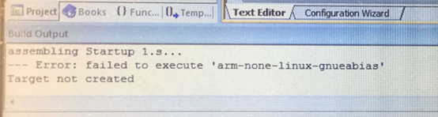
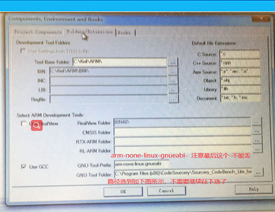
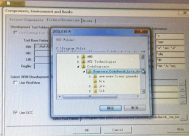

## 1、 Keil找不到交叉编译工具链Error：failed to execute ‘arm-none-linux-gnueabias’

   **问题描述**：           

​                                                         

**问题原因：**

  交叉编译工具链没有配置好；  

**解决方案：《严格按照汇编搭建教程》**

  检查交叉编译工具链配置如下图

 

## 2、 超级终端或者putty终端无打印

**问题描述：**  


**问题分析**：

```
1）、线的连接是否正确、电源线（上电电源灯是否亮）、串口线连接com2；  
2）、超级终端设置com口、波特率、数据流控、奇偶校验位是否正确  
3）、拨码开关是否有问题1000 SD’卡启动，0110 eMMC启动；  
4）、SD卡接触不良，我们提供的u-boot点亮了一个led，如果不亮可能是SD卡这里有问题，上电的同时按住SD卡卡槽  5）、核心板邮寄过程中掉落，没有按好；  
6）、u-boot有问题，我们邮寄前都测试过，这个可能比较小     
```


## 3、汇编 mov指令mov R1，1234报错

**问题原因：**

  汇编编译完成一个指令占用4个字节，mov r1，0x123，mov r1都会占用空间，留给后面数字只有12位，12位空间是不连续的，是离散的，0-255是可以连续写的，其他的是一些离散的数字  

**解决方法：**

  用伪指令ldr  

## 4、 点灯实验，控制LED灯代码：

```
*******************************汇编跑马灯.s****************************
.text

ldr  r0,=0x11000c40                                        
ldr  r1,[r0]                   
bic  r1,#0xf0000000   
orr  r1,#0x10000000           
str  r1,[r0]

ldr  r0,=0x11000c20                                        
ldr  r1,[r0]  				                 
bic  r1,#0x0000000f   
orr  r1,#0x00000001  									         
str  r1,[r0]

ldr  r0,=0x114001E0                                        
ldr  r1,[r0]                   
bic  r1,#0x000f0000 									  
orr  r1,#0x00010000           
str  r1,[r0]   

loop:

ldr  r0,=0x11000c44   
ldr  r1,[r0]           
orr  r1,#0x80  										                                            
str  r1,[r0]   

bl delay1s           


ldr  r0,=0x11000c44                        						                
ldr  r1,[r0]
bic  r1,#0x80   
str  r1,[r0]

bl  delay1s                   


ldr  r0,=0x11000c24   
ldr  r1,[r0] 														          
orr  r1,#0x01                                              
str  r1,[r0]   

bl  delay1s           


ldr  r0,=0x11000c24   											                                     
ldr  r1,[r0]
bic  r1,#0x01   
str  r1,[r0]

bl  delay1s

ldr  r0,=0x114001E4   
ldr  r1,[r0]          
orr  r1,#0x10                                              
str  r1,[r0]   

bl  delay1s           


ldr  r0,=0x114001E4 											                                       
ldr  r1,[r0]
bic  r1,#0x10   
str  r1,[r0]

bl  delay1s

b    loop           

delay1s:     
ldr      r4,=0x1ffffff                                     
delay1s_loop:        
sub   r4,r4,#1           
cmp   r4,#0                 
bne 			delay1s_loop        
mov   pc,lr     							          
.end

```

```c
**********************控制LED灯**************************
/*
	1、控制两个灯：
	#define  GPX1CON        (*(volatile unsigned int *)0x11000c20)
	#define  GPX1DAT        (*(volatile unsigned int *)0x11000c24)
	GPX1CON = GPX1CON & ~(0xf)|(0x1);
	GPX1DAT = GPX1DAT & ~(0x01)   |(0x01)   ;
*/

/*
2、控制四个灯
  功能:   按键K2按下后能触发中断输出字符

 作业:  实现K3 按下后能触发中断输出字符
*/

//----------------uart
#define  GPA1CON    (*(volatile unsigned int *)0x11400020)
#define  ULCON2     (*(volatile unsigned int *)0x13820000) 
#define  UCON2      (*(volatile unsigned int *)0x13820004) 
#define  UBRDIV2    (*(volatile unsigned int *)0x13820028) 
#define  UFRACVAL2  (*(volatile unsigned int *)0x1382002C) 
#define  UTXH2      (*(volatile unsigned int *)0x13820020) 
#define  UTRSTAT2   (*(volatile unsigned int *)0x13820010) 


//---------------interrupt
#define  GPX1CON        (*(volatile unsigned int *)0x11000c20)
#define  EXT_INT41CON   (*(volatile  int *)0x11000E04)
#define  EXT_INT41_MASK (*(volatile  int *)0x11000F04)
#define ICDISER1_CPU0  (*(volatile  int *)0x10490104)
#define ICDIPTR14_CPU0 (*(volatile  int *)0x10490838)
#define ICDDCR (*(volatile  int *)0x10490000)
#define ICCICR_CPU0  (*(volatile  int *)0x10480000)
#define ICCPMR_CPU0  (*(volatile  int *)0x10480004)
#define EXT_INT41_PEND (*(volatile  int *)0x11000f44)
#define ICCIAR_CPU0  (*(volatile  int *)0x1048000C)
#define ICCEOIR_CPU0 (*(volatile  int *)0x10480010)
#define ICDICPR1_CPU0 (*(volatile  int *)0x10490284)

//----------------led
#define  GPX2CON        (*(volatile unsigned int *)0x11000c40)
#define  GPX1CON        (*(volatile unsigned int *)0x11000c20)
#define  GPF3CON        (*(volatile unsigned int *)0x114001e0)

#define  GPX2DAT        (*(volatile unsigned int *)0x11000c44)
#define  GPX1DAT        (*(volatile unsigned int *)0x11000c24)
#define  GPF3DAT        (*(volatile unsigned int *)0x114001e4)

void led_init()
{
	GPX2CON = GPX2CON & ~(0xf<<7)|(0x1<<7);
	GPX1CON = GPX1CON & ~(0xf)|(0x1);
	GPF3CON = GPF3CON & (~(0xF << 16)) | (0x1 << 16);
	GPF3CON = GPF3CON & (~(0xF << 20)) | (0x1 << 20);

}

void interrupt_init(void)
{
	//-----外: 配置管脚的工作模式
	GPX1CON = (GPX1CON & ~(0xF<<4))|(0xF<<4);  //配置 GPX1_1为中断模式
	
	EXT_INT41CON = (EXT_INT41CON & ~(0x7<<4))|(0x2<<4);  //设置GPX1_1的触发方式为 下降沿触发
	EXT_INT41_MASK = EXT_INT41_MASK & (~0x02);		//GPX1_1 中断使能

	
	
	//-----内: 功能块设置
	ICDISER1_CPU0 = ICDISER1_CPU0 | (1<<25);	//EINT9 (GPX1_1)  GIC中断使能
	ICDIPTR14_CPU0 = 0x01010101;   //参考例子背景，用默认设置 
	ICDDCR = ICDDCR|1; //GIC 分发总使能
	ICCICR_CPU0 = 1;  // CPU0  中断使能
	ICCPMR_CPU0 = 0XFF;   //设置CPU0的优先级门槛为最低

	//KEY3
	//外
	GPX1CON = (GPX1CON & ~(0xF<<8))|(0xF<<8);  //配置 GPX1_2为中断模式
	EXT_INT41CON = (EXT_INT41CON & ~(0x7<<8))|(0x2<<8);  //设置GPX1_2的触发方式未 下降沿触发
	EXT_INT41_MASK = EXT_INT41_MASK & (~0x04);		//GPX1_2 中断使能

	//内
	ICDISER1_CPU0 = ICDISER1_CPU0 | (1<<26);	//EINT9 (GPX1_2)  GIC中断使能
}


void uart_init(void)
{
  //-----外: 配置管脚的工作模式
  GPA1CON = 0x22;  //配置GPA1_1 GPA10 为uart串口模式
  
  //-----内: 功能块设置
  //1.  uart 通讯协议格式的设置
  ULCON2 = 0x03;  //设置协议格式(  无校验位  1个停止位 8个数据位)
  UCON2 = 0x05;   //设置串口发送接收模式为polling模式
  
  /*2.  设置uart 的速度为115200
  DIV_VAL = (100000000/(115200 *16)) - 1 = 53.253
  UBRDIVn =  53
  UFRACVALn/16 = 0.253
  Therefore, UFRACVALn = 4
  */
  UBRDIV2 = 53;
  UFRACVAL2 = 4;
    
}


void putc(char c)
{
   while(1)
   {
      if(UTRSTAT2&0x02)  //检测发送是否为空
      {
         break;
      }
   }
   
   UTXH2 = c;  //发送字符
}


void do_irq(void )
{

  int irq_num;

   irq_num = ICCIAR_CPU0&0x3ff; ////中断ID号

   switch(irq_num)
   {
   case 57:

   	   EXT_INT41_PEND = EXT_INT41_PEND|(1<<1);  //清GPX1_1中断标志	   
  	   ICDICPR1_CPU0 = ICDICPR1_CPU0|(1<<25);    //清GIC GPX1_1中断标志
   	   break;
	case 58:
   	   putc('k');
   	   EXT_INT41_PEND = EXT_INT41_PEND|(1<<2);  //清GPX1_2中断标志	   
  	   ICDICPR1_CPU0 = ICDICPR1_CPU0|(1<<26);    //清GIC GPX1_2中断标志
   	   break;
   default:
   	   putc('e');
   	   break;
   }
   	ICCEOIR_CPU0 = (ICCEOIR_CPU0&0x3FF)|irq_num;    //结束中断	将处理完成的中断ID号写入该寄存器，则表示相应的中断处理完成
}

int main(void) 
{
	led_init();
    uart_init();
    interrupt_init();

	GPX2DAT = GPX2DAT & ~(0x01<<7)|(0x01<<7);
	GPX1DAT = GPX1DAT & ~(0x01)   |(0x01)   ;
	GPF3DAT = GPF3DAT & ~(0x01<<4)|(0x01<<4);
	GPF3DAT = GPF3DAT & ~(0X01<<5)|(0X01<<5);
	while(1)
	{
  	
	}
	return 0;
}

```

## 5、ARM串口实验作业：实现COM0或COM3口的串口输出信息

**问题描述：**

  如何实现COM0或COM3口的串口输出信息？  

**解决方案：**

  在uboot里默认只打开了com2口作为调试的接口，那么只有COM2可以输出信息到超级终端，  如果要实现COM0或COM3口，只需要通过COM2口去loadb  加载你写好的COM0或COM3的裸机程序，然后通过go命令去运行程序，当程序运行了之后将串口线拔下查到COM0或COM3上，就可以在 超级终端上看到串口的打印信息了。(板子里的uboot是com2的，只能开始是com2启动，然后程序加载之后换成con0实现预期效果):

```c
//设置com0输出字符
//1.找到电路图com0对应的引脚
//2.芯片手册找到对应的寄存器
// 		配置为串口模式
// 		功能块设置
//3.编写程序
//GPA0_0 GPA0_1为设置uart模式引脚
#define GPA0CON 	(*(volatile unsigned int *)0x11400000)
//设置uart0 的寄存器地址
#define ULCON0 		(*(volatile unsigned int *)0x13800000)
//设置uart0收发模式寄存器地址
#define UCNC0 		(*(volatile unsigned int *)0x13800004)
//设置波特率寄存器地址
#define UBRDIV0 	(*(volatile unsigned int *)0x13800028)
#define UFPACVAL0 	(*(volatile unsigned int *)0x1380002c)
//发送buf寄存器地址
#define URXH0 		(*(volatile unsigned int *)0x13800020)
//buf状态寄存器地址
#define UTRSTAT0 	(*(volatile unsigned int *)0x13800010)
void uart_init(void)
{
	//设置GPA00,1为UART模式
	GPA0CON = 0x22;
	//设置配置
	ULCON0 = 0x03;
	UCNC0 = 0x05;
	//设置波特率（Baud-rate）
	UBRDIV0 = 53;
	UFPACVAL0 = 4;
	
}
void put(char buf)
{
	while(1)
	{
		if(UTRSTAT0 & 0x02)
			break;
	}
	URXH0 = buf;
}

int main(void)
{
	uart_init();
	while(1)
	{
		put('b');
		delay1s();
	}
	return 0;
}

/*1.将GPA1_0和GPA1_1分别设置成串口2的接收和发送	GPA1CON*/
	GPA1.CON = GPA1.CON & (~(0xFF)) | 0x22;
	/*2.正常模式  无校验  一位停止位  8位数据位	ULCON2*/
	UART2.ULCON2 = 0x3;
	/*3.将收发模式设置成轮询模式	UCON2*/
	UART2.UCON2 = UART2.UCON2 & (~(0xF)) | 0x5;
	/*4.设置波特率为115200	UBRDIV2=53	UFRACVAL2=4*/
	UART2.UBRDIV2 = 53;
	UART2.UFRACVAL2 = 4;
	char RecDat = 0;        

```

## 6、no ‘execute read’ permission没有权限

**问题现象：**

​         

**解决方法：**

  链接map.lds  

 

