## Linux下的网络环境配置

在window下一般我们习惯使用图形界面配置网络，而Linux系统下就灵活的多，既可以使用图形界面配置网络又可以使用命令行的形式配置网络。介于网络中可以动态配置（通过DHCP自动获取），又可以使用静态配置（需要人工添加一些IP信息），所以就分为了x种配置方式：

**图形界面动态配置、（推荐）**

图形界面静态配置、（推荐）

**动态**命令行配置、（兼容老版本）

静态命令行配置、（兼容老版本）

一下首先介绍一下一些关于网络的基本概念帮助更好的配置网络。

### 3.1、基本概念

**IP****地址：**

网络中主机的唯一标识，通常使用的是IPV4的IP地址（32位的点分十进制，如192.168.1.200）。

**子网掩码：**

网络号全1，主机号全0的IP地址，用于和IP地址相与 &得到网络号，路由器根据此网络号决定是否向外网转发数据包（通常使用的C类子网掩码为255.255.255.0）。

**默认网关：**

网关即是一个网络通向另一个网络的IP地址，一般是默认是路由器的IP地址，习惯于使用本网段第一个可用的IP地址（如：192.168.1.1）,通过网关我们才能和外网进行“交流”。

**DNS:**

即是域名解析服务器，一般我们访问web网站使用的都是域名（如：[www.baidu.com）,而网络中IP地址才是唯一的标识，所以必须转化为IP地址才能访问网页，DNS就是可以把域名(如：www.baidu.com)转化为IP地址的服务器，（一般使用网关IP如192.168.1.1 （推荐），或8.8.8.8 或114.114.114.114）。](http://www.baidu.com）,而网络中IP地址才是唯一的标识，所以必须转化为IP地址才能访问网页，DNS就是可以把域名转化为IP地址的服务器，（一般使用网关的IP如192.168.1.1，有的是8.8.8.8）。)

**DHCP:**

动态主机配置协议，一种应用层协议。专门用于动态获取主机的网络IP信息，通过DHCP可以得到一个可用的IP地址以及一些其他的网络信息。

 

### 3.2、桥接：（独立的两张网卡-两个独立IP）

可以使得我们的虚拟机直接连接到物理网络，也就是说虚拟机的IP和主机的IP是两个不同IP地址，有两个网卡，一个是主机的真正的网卡，一个是虚拟机的虚拟网卡。

无论是图形界面配置网络还是命令行都必须首先保证“两个”桥接要设置好。

第一个桥接：

虚拟机->设置->硬件->网路适配器->选中桥接模式->确定：（如图配置）

​             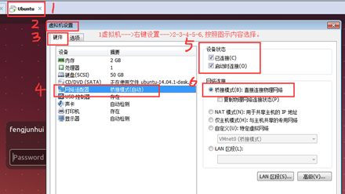                  

第二个桥接：编辑->虚拟网络编辑器->选中桥接模式->指定桥接网卡（可选）->确定：

 

注意：一般的电脑都有无线网卡和有线网卡，不同的电脑的有线网卡或无线网卡的名字不太一样，一般有线带PCIe，无线带Wireless，注意区分就好；

如果你电脑没有网线接口，可以借助无线网卡实现Ubuntu环境的网络连接，那么你选择桥接到无线网卡，然后点击应用--->确定就可以了；

如果你电脑通过网线和Ubuntu环境直连了，那么可以直接桥接到有线网卡上；

如果你的是USB转网卡，那么桥接到对应的USB转网卡上就可以了。

**基本思想：你的那个网卡可以上网，你就桥接到那个网卡上。**

 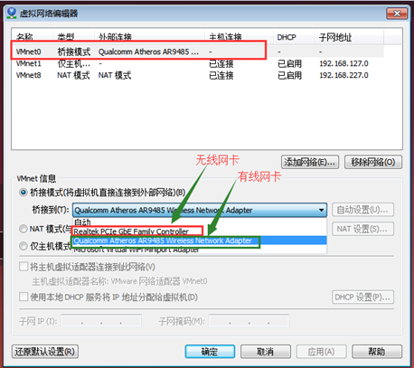

### 3.3桥接模式的图形界面配置（推荐）

#### 3.3.1、动态配置

（如下图步骤---一步一步操作就OK）

 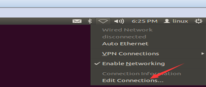

 

 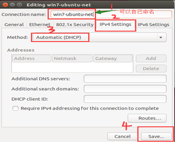

   重新关闭网络，然后再使能网络：（点击红色框）---然后选择win7-Ubuntu-net，你刚刚配置的名字；

   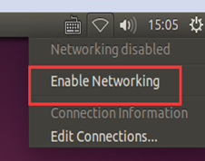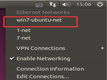

注意：如果你桥接的是无线网卡，请保证你的Windows的电脑的WiFi可以上网，如果你桥接的是有线网卡，那么请保证有线可以上网。

#### 3.3.2、静态配置

**3.2.1****、演示配置WiFi的静态IP信息；**

先打开编辑--->虚拟化网络编辑器--->桥接到WiFi网卡哟：如下图

 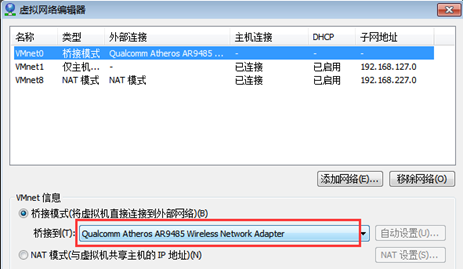

按照 **2桥接** 好网卡之后，只需要配置好Ubuntu的静态IP就OK了，操作流程如下：打开Windows下的命令行：

Win + R

输入cmd 

 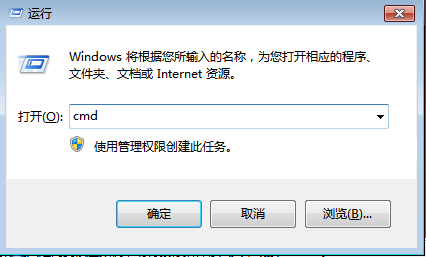

输入ifconfig，可以查看到你当前的Windows电脑主机的网络连接情况和ip地址信息，

 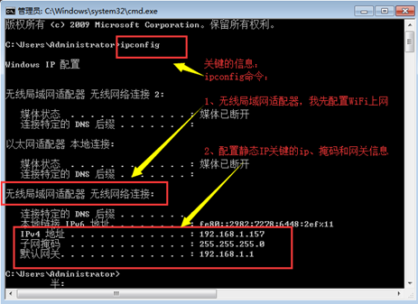

接下来进入Ubuntu配置界面，按照1-2-3-4-add-5-6-7的步骤就可以配置好静态IP地址；

Address---IP地址 ：192.168.1.x,就可以了；

Netmask---子网掩码： 和ipconfig看到的子网掩码一样

Gateway -- 默认网关： 和ipconfig看到的默认网关一样

DNS server -- DNS服务器： 和ipconfig看到的默认网关填充一样就可以

 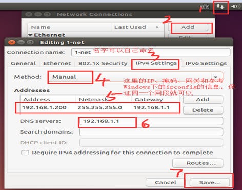

选择配置好的1-net网络： 

 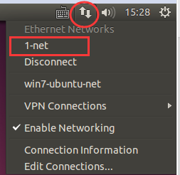

然后 ctrl + alt + t 打开一个新的终端：

借助ifconfig可以看到你刚刚配置的网络信息： 

 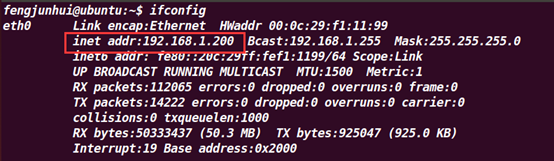

终端上输入ping [www.baidu.com](http://www.baidu.com) 出现如下现象表示网络OK；

ping www.baidu.com

 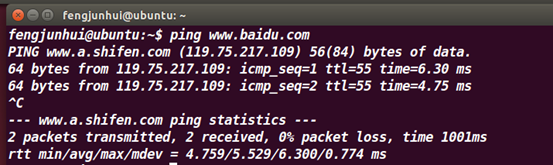

**3.2.2****、演示配置有线的静态IP信息；**

**注：后期学习系统移植的时候，只需要配置好静态IP，然后板子和Ubuntu直连，桥接到有线网卡上就可以了。**

先打开编辑--->虚拟化网络编辑器--->桥接到PCIe 有线网卡哟：如下图

 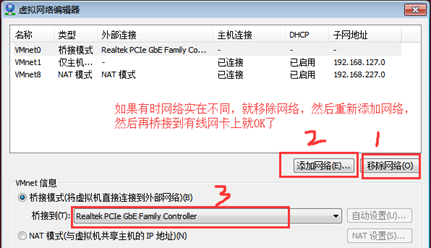

按照 **2桥接** 好网卡之后，只需要配置好Ubuntu的静态IP就OK了，操作流程如下：打开Windows下的命令行：

Win + R

输入cmd 

 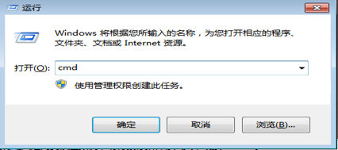

输入ipconfig，可以查看到你当前的Windows电脑主机的网络连接情况和ip地址信息，

 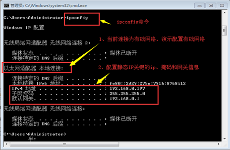

接下来进入Ubuntu配置界面，按照1-2-3-4-5-6-7的步骤就可以配置好静态IP地址；

Address---IP地址 ：192.168.0.x,就可以了；

Netmask---子网掩码： 和ipconfig看到的子网掩码一样

Gateway -- 默认网关： 和ipconfig看到的默认网关一样

DNS server -- DNS服务器： 和ipconfig看到的默认网关填充一样就可以

 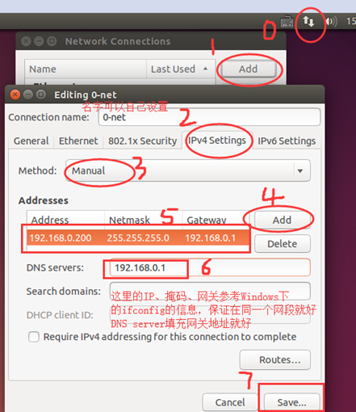

Disconnect网络链接，然后再enable网络链接，选择配置好的0-net网络： 

 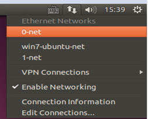

然后 ctrl + alt + t 打开一个新的终端：

借助ifconfig可以看到你刚刚配置的网络信息： 

 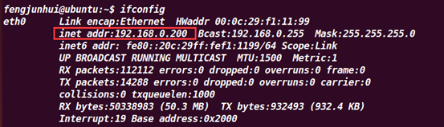

终端上输入ping [www.baidu.com](http://www.baidu.com) 出现如下现象表示网络OK；

ping www.baidu.com

 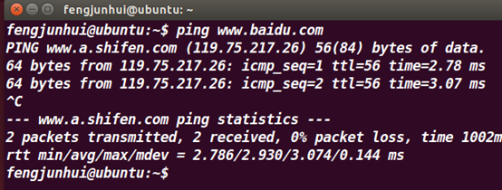

-----------------到这里网络配置就OK了，不需要再继续往下看了。

如果还有问题（比如你是公司的网络或校园网：比较头疼），那么可以考虑下面的网络配置：NAT模式

 

### 3.4、NAT模式（虚拟网卡-共享主机的ip地址）

(公司的网络或校园网 : 可选）

如果你的网络ip资源紧缺，但是你又希望你的虚拟机能够联网，这时候NAT模式是最好的选择。NAT模式借助虚拟NAT设备和虚拟DHCP服务器，使得虚拟机可以联网。

VMware Network Adapter VMnet8的作用是主机与虚拟机之间的通信。

无论是图形界面配置网络还是命令行都必须首先保证“两个”NAT要设置好。

第一个桥接：

虚拟机->设置->硬件->网路适配器->选中NAT模式->确定：（如图配置）

 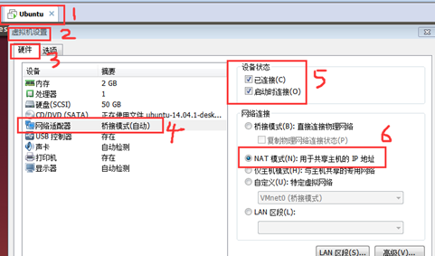

第二个NAT：编辑->虚拟网络编辑器->选中NAT模式-->确定：

 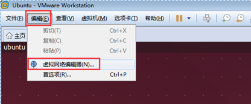 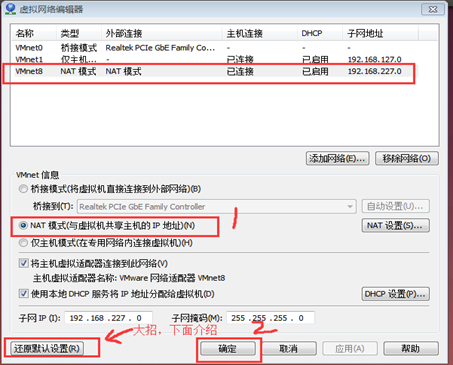

大招介绍：（轻易不放大招哇）

如果你的网络怎么搞都有问题，那么你可以放大招了，首先关闭虚拟机，然后打开编辑--->虚拟化网络适配器--->还原默认设置--->然后再按照前面的步骤配置网络。

自动分配一个IP就OK了

（如下图步骤---一步一步操作就OK）

   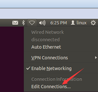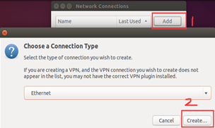

 

 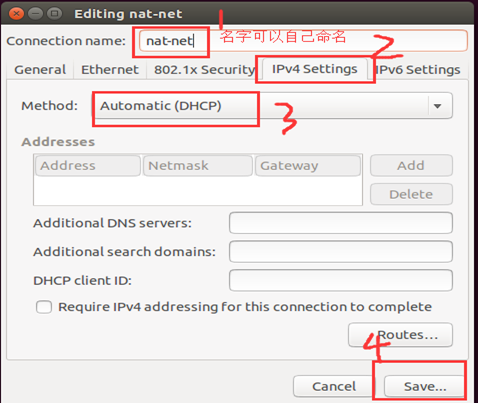 

Disconnect网络链接，然后再enable网络链接，选择配置好的0-net网络：

 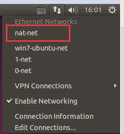

然后 ctrl + alt + t 打开一个新的终端：

终端上输入ping [www.baidu.com](http://www.baidu.com) 出现如下现象表示网络OK；

ping www.baidu.com

 

-----------------到这里网络配置就OK了，不需要再继续往下看了。

### 3.5、两个命令ifconfig和ping

**ifconfig****命令：用于查看网卡的配置信息**

 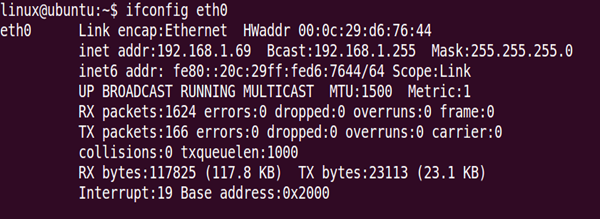

**ping****命令：用于检测主机之间的连通性**

ping IP地址/域名

 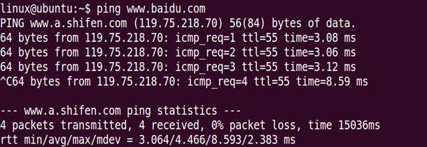

### 3.6、命令行配置网络 --- 不推荐使用，古老的配置方式

（适用于Ubuntu12.04及之前的版本，我们的学习环境用不到）

还原网络配置、也需要将图形界面配置的删除掉，以免造成影响。

#### 3.6.1、动态配置（如下图步骤）

这里需要一个配置文件：**/etc/network/interfaces**

sudo vi /etc/network/interfaces 打开添加配置信息为dhcp获取：

​    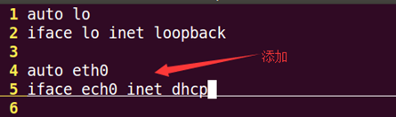

保存退出，然后输入：**sudo reboot** 重启生效，配置完成后，通过ifconfig查看网络配置信息 通过ping命令来查看能否上网，显示出相关信息证明配置成功。

#### 3.6.2、静态配置

sudo vi /etc/network/interfaces 打开添加配置信息为**static获**取：(这是要保证配置的IP地址不能和局域网的其他主机冲突)

 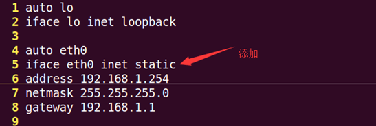

保存退出。

此时可以在局域网中进行通信但是不能访问wab网站，需要设置域名服务器IP。sudo vi /etc/resolv.conf 打开添加域名服务器IP，也可以添加多个，当一个dns不能使用可以使用其他的。

 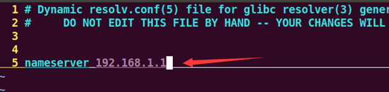

保存退出。

以上文件当开机时候会清除，所以会造成无法上网。可以通过修改启动脚本/etc/rc.local添加**echo “nameserver 192.168.1.1” >> /etc/resolv.conf**解决。

**sudo vi /etc/rc.local**打开添加：

 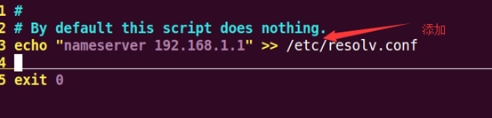

保存退出。然后输入：**sudo reboot** 重启生效，配置完成后，通过ifconfig查看网络配置信息 通过ping命令来查看能否上网，显示出相关信息证明配置成功。