### 前言：

Source Insight是一个非常优秀的代码阅读工具，用Source Insight建立一个代码阅读工程，并使用它来阅读、修改、添加、移除代码来说是非常方便的，学好对它对你未来的发展会有很大的促进作用。

### 6.1、sourceinsght的安装与破解

​    1、source insight 我们有汉化绿色版，这个是比较新的版本，兼容了win8、win10

​    首先安装4.00.0086原版 sourceinsight4080-setup.exe 进行安装，一路next，最后安装完成，在桌面出现右图所示的图标。

 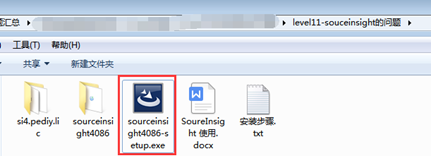

​     2、选择桌面安装图标，右键--->属性--->打开文件位置.（注：我的安装在C:\Program Files (x86)\Source Insight 4.0）

 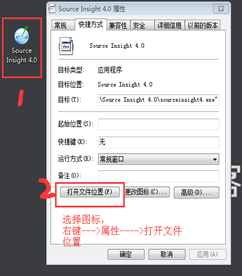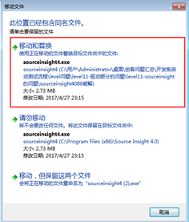

​    2、然后选择 “sourceinsight408破解” 目录下的文件 sourceinsight4.exe 替换掉桌面程序所在的路径文件即可。（如右上图，选择移动和替换）

​         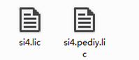

3、拷贝《si4.pediy.lic》目录下秘钥到安装路径下，（注：就是你桌面图标右键打开的位置，我的安装在C:\Program Files (x86)\Source Insight 4.0）

 

4、双击打开会提示填充秘钥：--->选择：import导入一个本地秘钥-->选择注册许可si4.pediy.lic，然后就OK了，破解到此结束，可以关闭它了。

 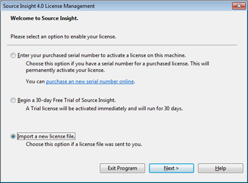

### 6.2、Source Insight建立一个工程的基本操作

#### 6.2.1、前提条件

Source Insight版本 ： 4.0

源代码 ：linux-3.14.0

#### 6.2.2、建立工程的步骤

1、解压你的Linux-3.14.tar.xz的内核源码，我解压后的路径在E:\KernelSource\linux-3.14，然后在这个路径下 新建一个SI4的文件夹（后期用于存放工程文件）

 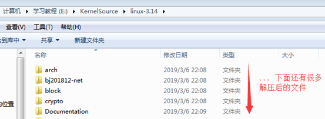

2、打开Source Insight，工具栏选择Project -> New Project，如下所示：

 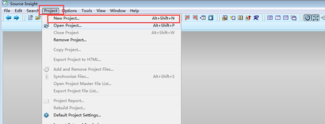

3、接下来，出现了这个对话框，

 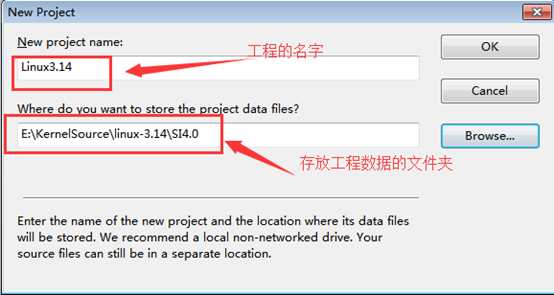

填入工程的名称，以及工程文件生成的目录（一般会在要阅读的源代码根目录下建立一个目录来存放工程生成的文件）。点击OK弹出如下界面，删掉SI4.0就是你的工程路径：

 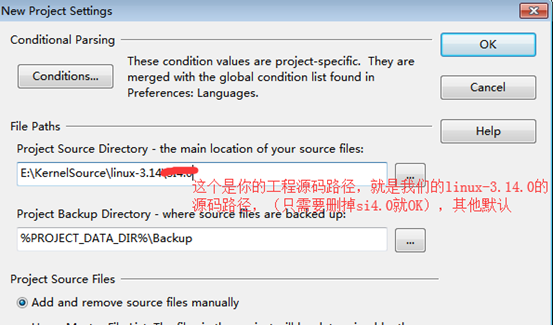

选择源代码工程的根目录，然后点击OK，如下所示：

 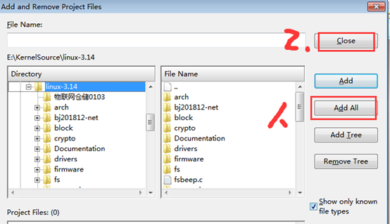

```
在右边有四个按钮用来将源代码添加到工程当中，这几个按钮的功能分别是：
Add ：基本的文件添加操作
Add All ：添加整个工程所有的源文件（可以选择是否递归添加子目录中的源文件）
Add Tree ：添加指定的文件夹以及其子目录下的源代码文件
Remove Tree ：和Add Tree的功能相反
Add ALL添加所有文件添加完需要阅读的代码之后，直接点击close关闭即可。
然后将添加的代码进行同步，生成阅读代码的索引和辅助文件，方便对源代码进行阅读，如下所示：
```

 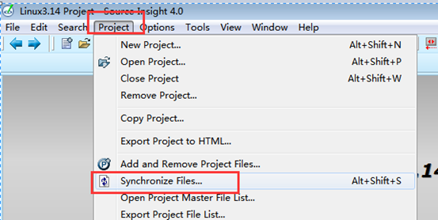

默认的工程建立完毕之后对有些后缀名的文件是有过滤的，但是在实际工程当中对有些代码是需要阅读的，比如在这个工程当中的.S、.s等文件就不会直接在[工程索引](https://www.baidu.com/s?wd=工程索引&tn=24004469_oem_dg&rsv_dl=gh_pl_sl_csd)当中找到，所以还需要进行如下的设置：

 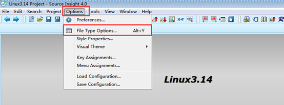

然后进行如下设置：

 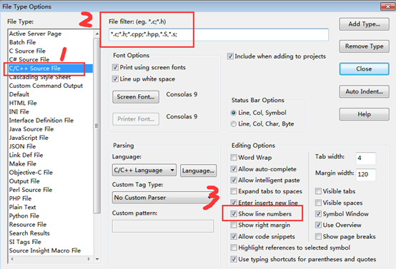

至此，整个工程建立完毕。

### 6.3、sourceinsight快捷键的使用：

首先需要点击下面1位置和2位置，界面和如下比较接近。

 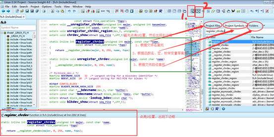

```
快捷键学习： 
基本使用
ctrl + 鼠标左键 追函数
ctrl + /  全局搜索
双击 ： 按下F8，标记内容
F3  向上切换（需要先选择你查找的内容）
F4  向下查找
ctrl + G 指定某一行 （出错时快速定位）
option-->file type option -->show line numbers  显示行号
```

 