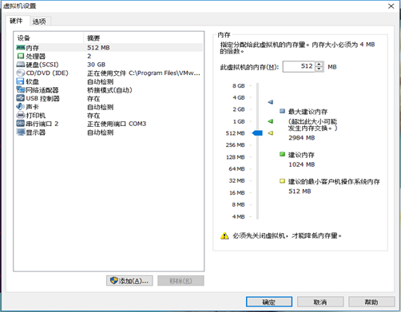
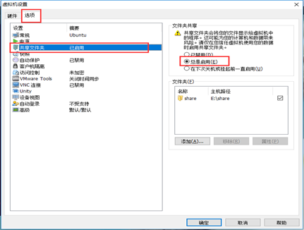
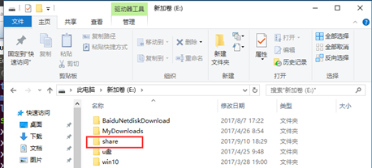
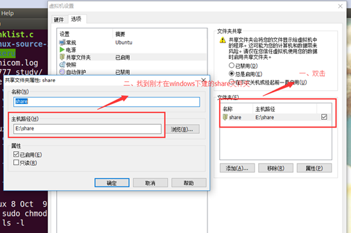

## Ubuntu下共享文件夹设置

一、点击虚拟机->设置，出现界面如图所示：

​                               

二、点击选项->共享文件夹->总是启用，出现界面如图所示

 

三、在Windows自己喜欢的一个路径下建一个share文件夹，我的如图所以：

 

四、设置共享目录并点击确定

 

五、/mnt/hgfs/share就是Ubuntu下的共享目录，把文件复制到这里就ok了。

 

 