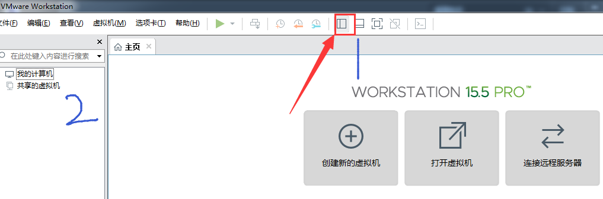
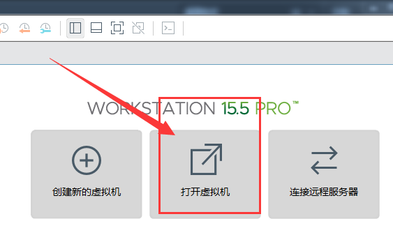
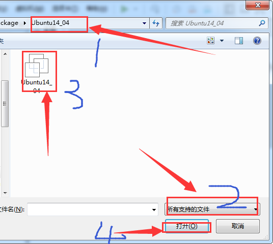
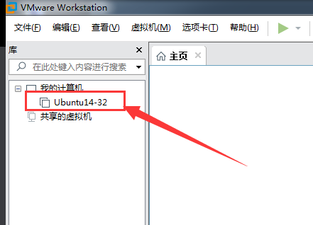
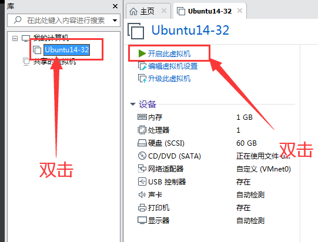
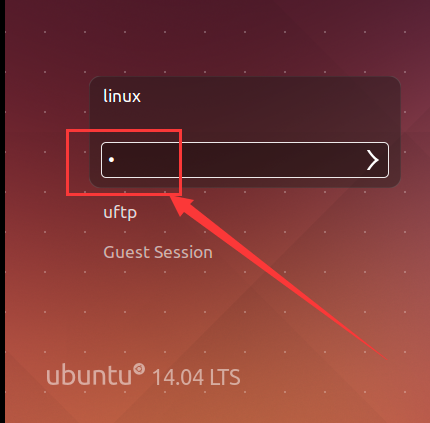
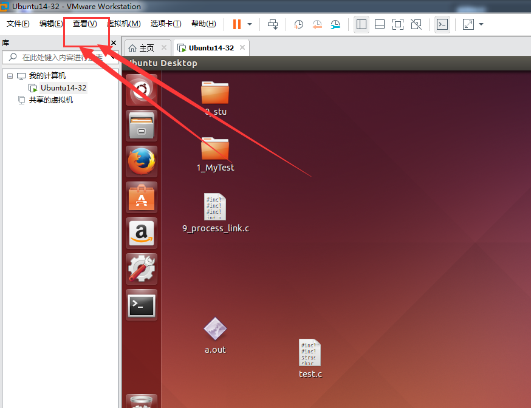

两种的方法：

1、简单方法：在下下一章Ubuntu环境搭建视频版里面说了。下载《懒汉版ubuntu环境》，这个懒汉版环境我们创客学院搭建好的环境，很简单很方便，可以直接使用（特别推荐使用创客学院课后资料里面的懒汉版ubuntu环境）。

如果课后资料下载不了。可以使用备用下载地址：https://pan.baidu.com/s/1GJJfg78usDNsodkGA0v-OQ

请尽量不要把压缩包放到C盘，专门在D盘或者其它盘创建一个文件夹来存放环境，且路径尽量没有中文字符。

（1）、右键压缩包，解压到文件夹，

（2）、双击打开虚拟机（前提：虚拟机必须在属性-兼容性-中设置以管理员身份运行）

​		然后点击1显示/隐藏库 打开左边目录栏2

（3）点击打开虚拟机

（4）找到你刚刚解压的那个ubuntu坏境文件夹-选择所有支持的文件-点击白色的Ubuntu14_04-点击打开

（5）然后你的环境就会出现在这个列表里

（6）、双击打开Ubuntu，然后会出现一个画面，点击【我已复制该虚拟机】

（7）、输入密码   1，点击回车，稍稍等待。

（8）、好了，系统打开成功，接下来你就可以写代码了。如果你的窗口太小的话，可以点击【查看】-立即适应客户机。就好了。

此时你的懒汉版环境已经打开成功，你就可以开开心心的使用啦。

当然这个是比较简单的，也是我们推荐你们使用的。

下一章是介绍怎么通过.iso镜像去搭建环境的，但是很容易出错，我们**不推荐使用**。