重头开始搭建Ubuntu14.04环境需要一个.iso镜像。

咱们创客学院LV1-Day1,课后资料有，请你们自行下载；

如果链接失效，这边有一个备用云盘链接：https://pan.baidu.com/s/1PDHEZjYvzdcTY-S_FznLSA

下载这个.iso镜像放到一个文件夹下（建议不要下载到C盘。请在**除了C盘**以外的其他盘单独建一个文件夹来专门存放这个环境）

我是放到了D盘站们创建的一个文件夹里面。好了，接下来开始搭建环境：

1、双及虚拟机图标打开虚拟机：

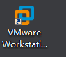

2、点击【创建新的虚拟机】

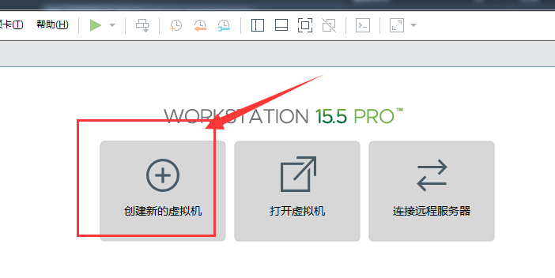

3、典型-下一步

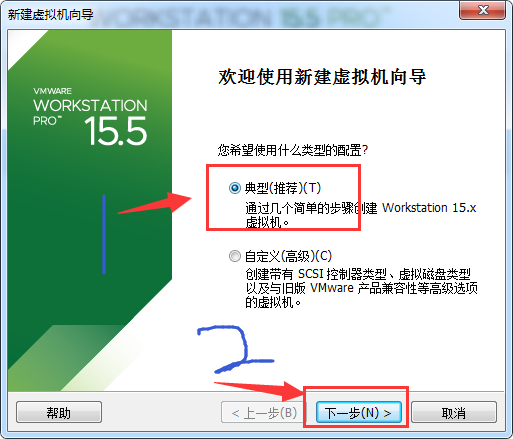

4、稍后安装-下一步

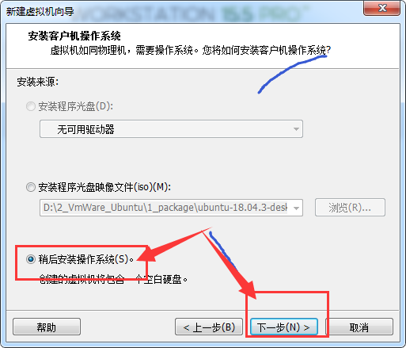

5、Linux-ubuntu-下一步   （这一步，如果你是搭建64位的话，可以选择Ubuntu64，但是创客学院使用的是32位的，所以此时选择ubuntu就可）

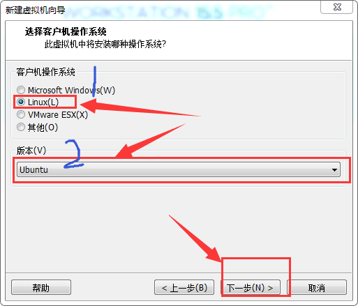

6、你创建的这个环境放在的地方。那个盘尽量有至少60G空间吧。（我一般两年能用20G左右。所以用的地方也不是很大）

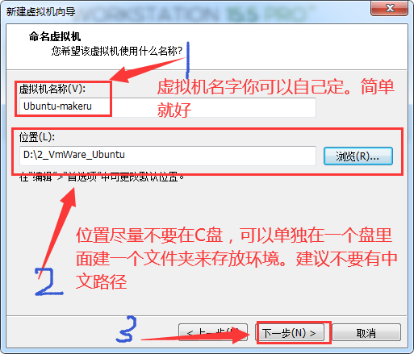

7、磁盘大小不是说你设置多少就立刻占用你磁盘多少空间。而是越来越大，我现在已近用了20G左右。

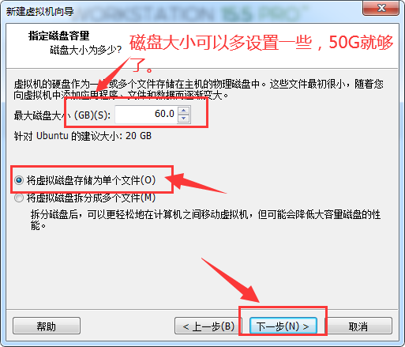

8、点击完成

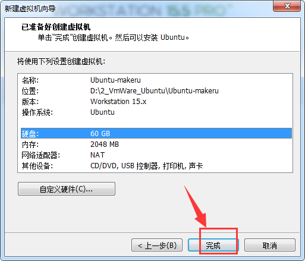

9、这时候你会有个界面出来，然后点击最上面 显示/隐藏 库 可以选择是把左边列表是显示出来还是隐藏。

双击Ubuntu-makeru  然后双击 编辑虚拟机设置；

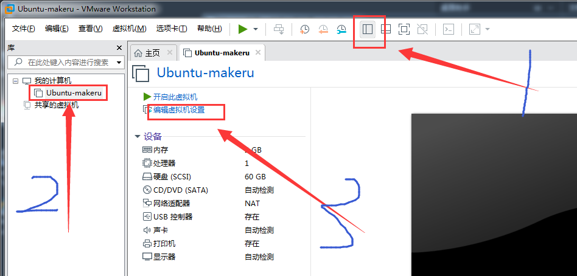

10、然后去选择使用.iso镜像

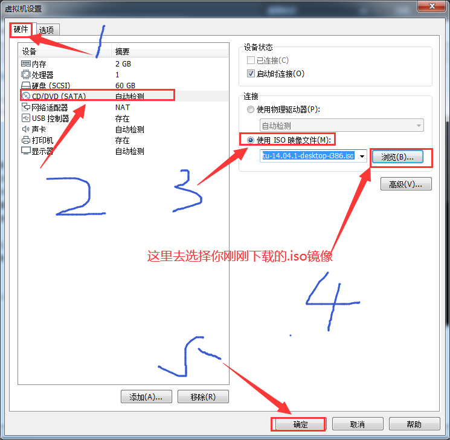

11、然后双击开启虚拟机

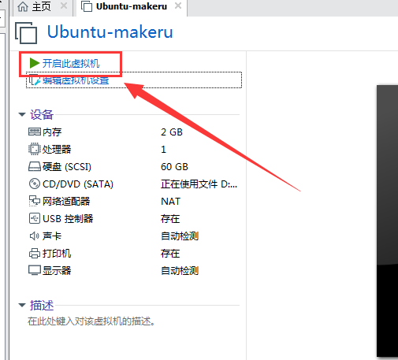

12、然后让他自己安装不用管了就好了

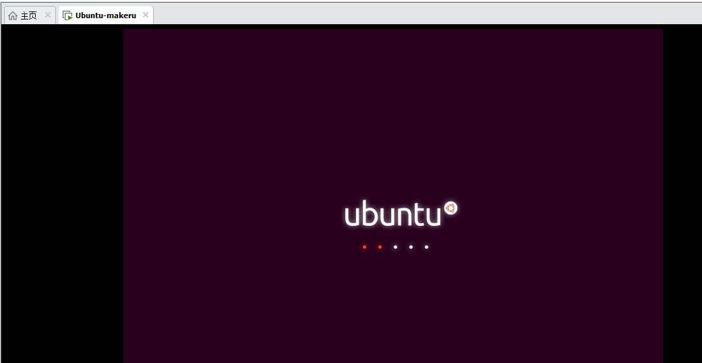

13、接下来设置基本属性；语言你可以选择英语English，也可以选择汉语（你爱怎样怎样。）

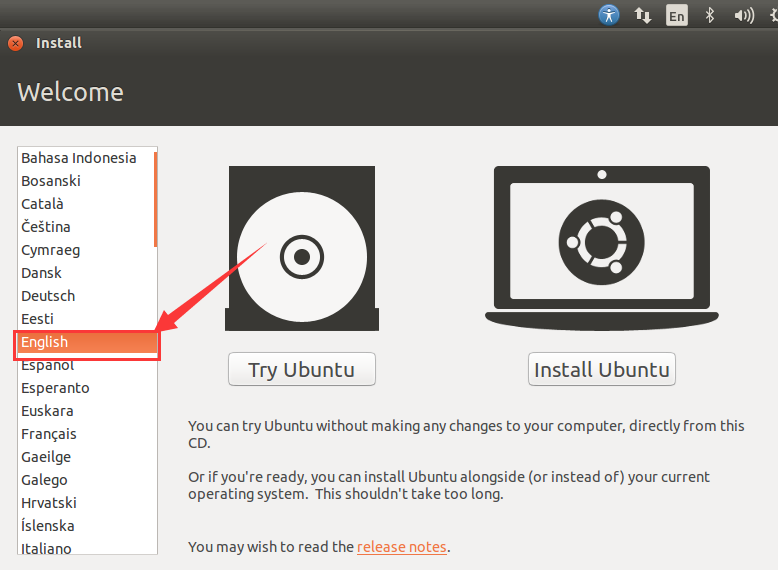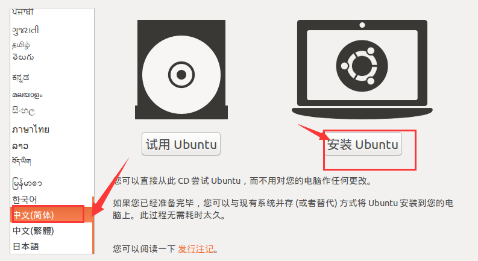

我这里是选择中文。然后点击安装。

13、点击继续

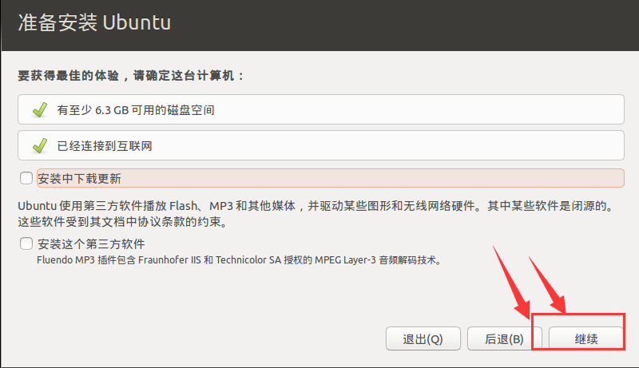

14、擦除整个磁盘，现在安装

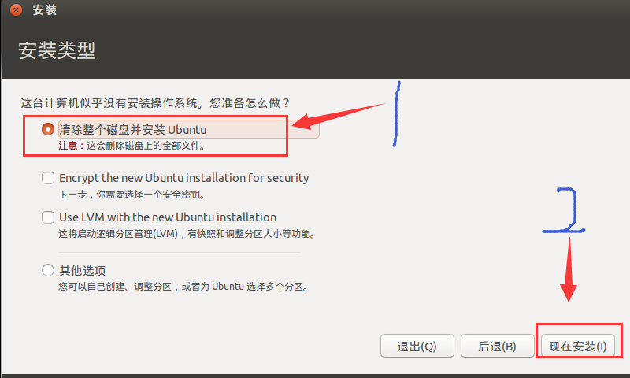

15、时间设置：鼠标点击中国的位置就会出现中国的时间。我的是重庆时间。然后点击继续

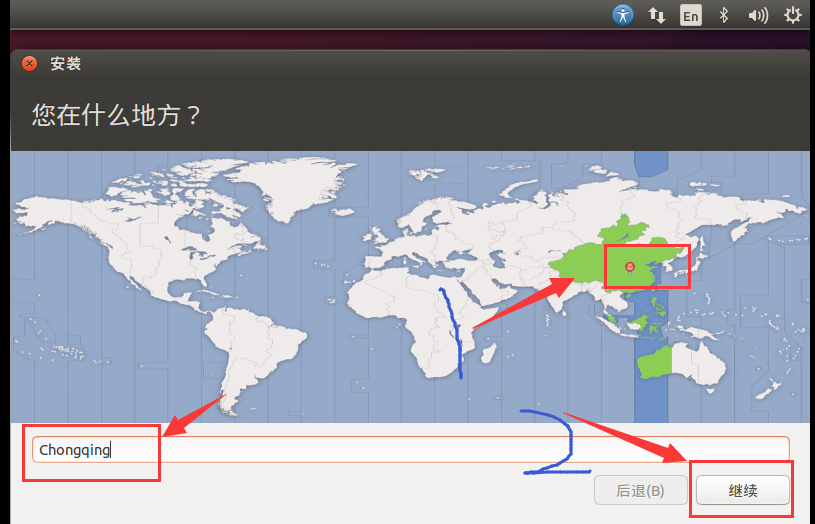

16、键盘布局默认就行，点击继续，后期我们会安装搜狗的

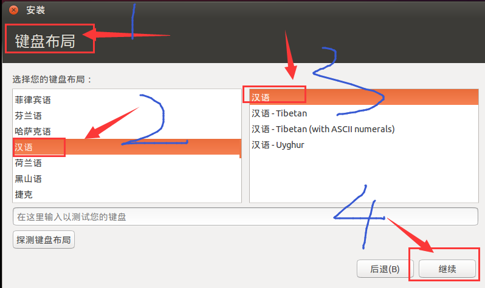

17、名字密码设置，都设置完了点击继续。

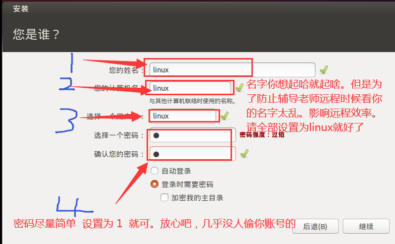

18、然后就漫长的等待啦，不要急，慢慢等。可以趁这会儿扣扣手机喝喝茶；

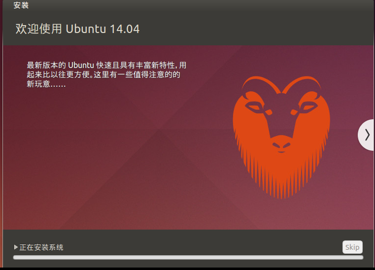

19、漫长的等待之后初步环境大家安好了。点击重启

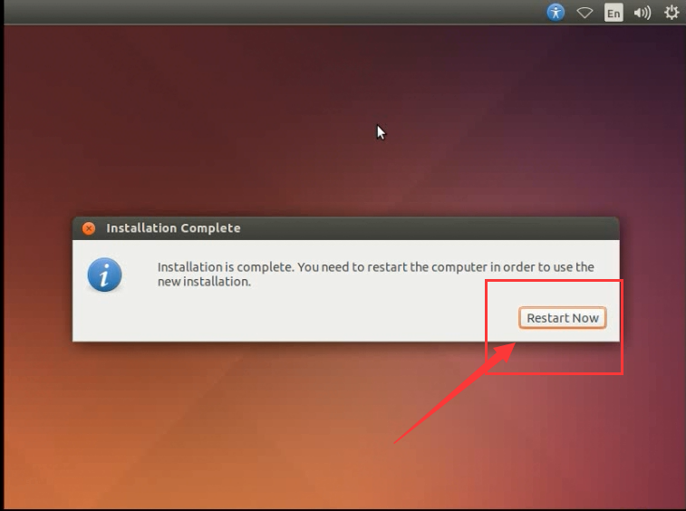

好了，初步环境搭建结束。里面的功能属性搭建，请查看下一章节。。。。。