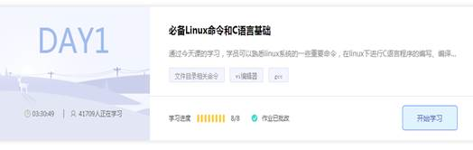
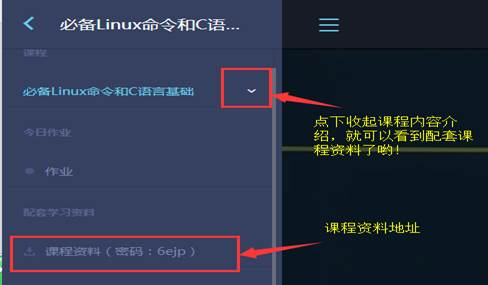
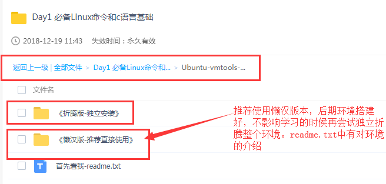

## Ubuntu环境搭建（视频版）

**解决方案：**

查看level1day1客户百度云提供的资料，有安装所需的文件和详细的安装教程，可以参考一下。链接地址左下角有课程资料地址：http://www.makeru.com.cn/video/1862.html

  

 

直接提供百度云盘连接地址：

地址：[https://pan.baidu.com/s/1QHd_uTqGgQMS8f07LN465Q#list/path=%2F](https://pan.baidu.com/s/1QHd_uTqGgQMS8f07LN465Q#list/path=/)

密码：6ejp

