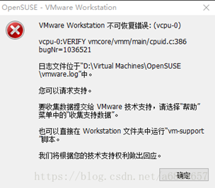
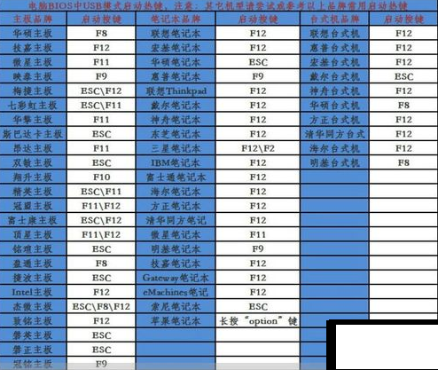
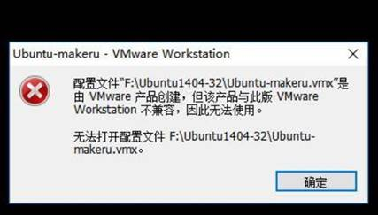

##  CPU虚拟化问题

**问题描述：**

在安装虚拟机时，出现vcpu-0 不可恢复性错误。 

​    

**解决办法：**

1、重启电脑进入 BIOS方法：电脑重启开机时，按ESC 或 F2、或F5、F8或delete等..不同的品牌进入BIOS的方式不同，仅供参考，

2、进入BIOS后，找到菜单 Advanced/Intel(R) Virtualization Technology 选项设置为 Enable，保存退出；（多找找）

3、重新打开虚拟机即可。

参考链接：https://jingyan.baidu.com/article/ab0b56305f2882c15afa7dda.html

 Win7-32位无法安装课程提供的VMware环境问题

**问题描述：**

win 7 32位系统上安装不上vmwareworkstations，怎么办？

**解决方案：** 

1、可以更换为64位的系统，如果学生不想重装系统，可以选择下面的云盘连接： 安装vmware10的环境。

链接：https://pan.baidu.com/s/1HvLdIQ0QjH8PwEm28kyDTg 

提取码：5uwl 

2、推荐重装系统，将系统更换为win7-64位的系统（或win10系统），因为当前的很多软件和开发环境都是基于64位的系统来开发的。可以下载深度技术的系统，安装简单快捷，具有下载完后，一键重装系统的优势，不需要制作系统启动盘，

参考连接如下：http://win.51apps.com.cn/shendu.html

 

​      

 

## Vmware10和VMwareworkstation12的兼容性问题； 

镜像创建使用的是VMware Workstation12.04的版本，但是不排除某些学生用VMwareWorkstation10搭建的环境。

如果大家不是采用的我在安装所需文件\VMware Workstation 12安装+破解包 提供的VMwareWorkstation12,而是采用VMware 10的安装包，

那么你在开启提供的镜像Ubuntu-Makeru时，会遇到如下的兼容性问题，（解决方案见下面）

1、 进入解压的Ubuntu1404-32的目录下，找到Ubuntu-Makeru.vmx后缀的文件（我的是Ubuntu.vmx，一样的），

2、 右键notpad++（或记事本）打开*.vmx后缀文件

​    找到文件中的virtualHW.version = "12"字段，修改该字段为virtualHW.version = "10"；

​    保存.vmx文件，再次开启虚拟机。VMware Workstation 12创建的虚拟机可以在VMware Workstation 10.0的环境下运行。

​    （不过建议采用VMwareWorkstation12 , 好用，稳定）

参考扩展链接：https://blog.csdn.net/yumushui/article/details/45039063

 