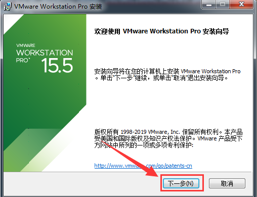

VMware虚拟机安装教程：

（VMware_15虚拟机下载地址及激活码：     https://pan.baidu.com/s/1ZOkN78YrhDO3gGw0nBayww）

资源包下载到本地之后解压打开会有两个文件：

1、选中【VMware-workstation-full-15.5.0-14665864】鼠标右击选择【以管理员身份运行】安装虚拟机：

2、需要等待一下：

3、点击【下一步】

4、勾选【我接受许可协议中的条款】，点击【下一步】。

5、建议点击【更改】，来更改软件的安装目录建议安装在除C盘之外的磁盘，可在D盘或者其他磁盘新建一个文件夹来安装逊虚拟机，点击【下一步】。（个人认为有的软件需要添加环境变量不能有任何汉字以及汉字符号，所以建议各位学员您们电脑磁盘的名字以及文件夹名字尽量全部英文不要出现中文字符）

6、取消勾选，点击【下一步】。（版本更新是很麻烦的事儿，一不小心就缺东少西环境出现毛病，建议各位取消勾选）

7、点击【下一步】

8、点击【安装】

9、安装中，请稍作等待：

10、点击【许可证】

11、打开然后随便复制一串秘钥输入到【许可证秘钥格式】中，然后点击【输入】

12、点击【完成】

13、在桌面找到【VMware Workstation Pro】，右键打开属性：

14、选择兼容性以【管理员身份运行此程序】，点击【确定】

好了。此时虚拟机VMware15已安装完成。恭喜恭喜~~~~