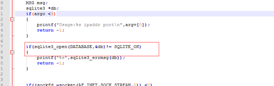

## 1、编译代码出错：fatal error:sqlite3.h No such file or directionary on terminated

**问题描述：**

```
gcc  sqlitefile.c -lsqlite3  
编译报错：fatal error:sqlite3.h No such file or directionary on terminated  
```

**问题分析：**

  数据库的包安装不完整，建议在线安装  

**（1）、先保证网络畅通，**

```
可以先更新一下源 ：sudo apt-get update  
再更新一下包的依赖：sudo apt-get -f install  
```

**（2）、然后在线安装：（推荐）**

```
sudo  apt-get install sqlite sqlite3   
sudo  apt-get install libsqlite3-dev  
sudo  apt-get install sqlitebrowser  
或离线安装：（可选--不推荐）  
sudo  dpkg -i *.deb　　（数据库安装文件）  
```

## 2、数据库插入数据时的操作问题： 

**问题描述：**

```
accept  ok   
wait  for send data  
accept  error:Bad file descriptor  
第一次都是正确的  
收到的数据是错误的  
```

**解决方案：**

  学员在学习数据库和网络编程结合的时候，会出现上述问题，表面上看是Bad file Descriptor，但是当你检查完网络相关的代码之后，你会发现没有问题，奇怪了，为什么呢？  答案是： 数据库的使用不对，sqlite3_open，只是创建了并打开了一个数据库，但是对数据库的操作都是基于表的，所以还需要创建一张表，调用sqlite3_create_table(…) ，否则会插入数据失败。                                                                          

 