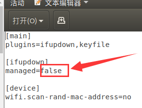
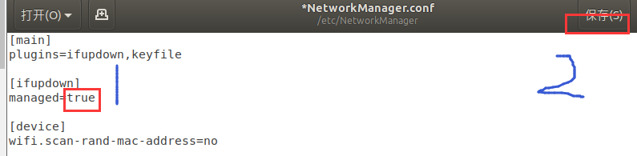
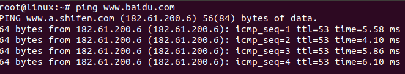
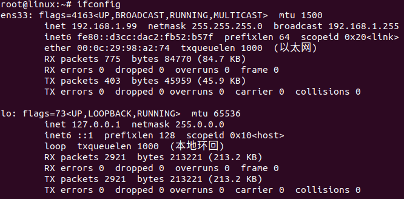

1、终端输入：

```
sudo service network-manager stop
sudo rm /var/lib/NetworkManager/NetworkManager.state
sudo service network-manager start
```

一般此时图标已经出来了。

然后：

```
sudo gedit /etc/NetworkManager/NetworkManager.conf
```

把false改成true

把false改成true






最后：

```
sudo service network-manager restart
```

网络测试：ping  www.naidu.com



查看网段：




结束。。。。。。