## 安装vmware tools 

设置共享文件夹需要先安装**vmware tools **

然后点击VMware菜单栏“虚拟机”下的“安装VMware Tools”

​                         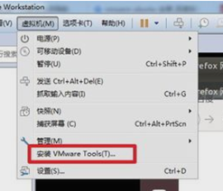      

然后，会在Linux的系统桌面上生成一个名字为“VMware Tools”的光驱文件。

 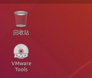

双击“VMware Tools”光驱文件并进入，会看到一个后缀为.tar.gz的压缩文件。

 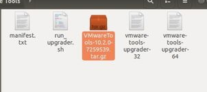

将压缩文件复制到home目录下

打开命令行终端，默认应该就是home目录，如果不是home目录，在命令行终端输入“cd ~”命令进入home目录下，在home目录下输入"ls"命令就可以看到我们刚刚复制的压缩包文件。

 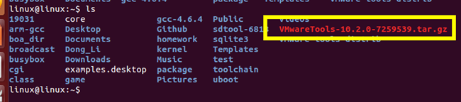

执行 tar -xvf VMwareTools-10.2.0-7259539.tar.gz

 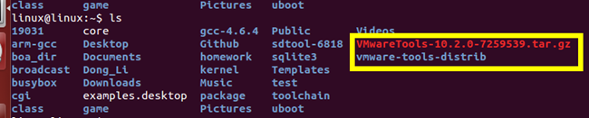

进入解压后的目录 

 

执行 sudo ./vmware-install.pl 一路回车 + yes

重启客户机 然后就可以正常复制文件 和 设置共享文件夹了

 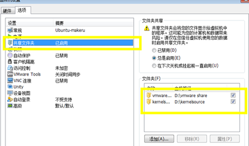

 

 

 

## vim配置：

1、拷贝vimconfig.tar.gz压缩包到自己的虚拟机

​                              

2、在自己vimconfig.tar.gz所在的路径输入tar -xvf vimconfig.tar.gz对该压缩包进行解压，人下图所示

 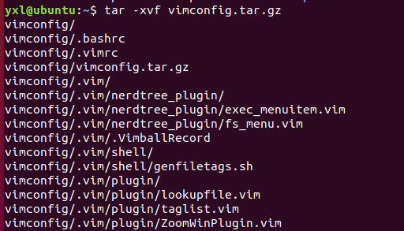

解压完成如下图所示，生成vimconfig目录

 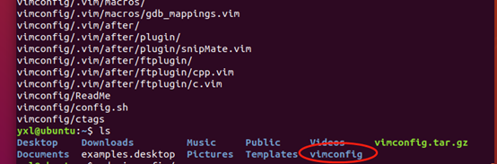

3、cd切换到vimconfig目录，执行config.sh，如下图

 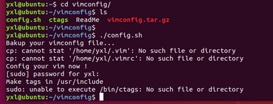

报这些问题不要紧，在线安装ctags

 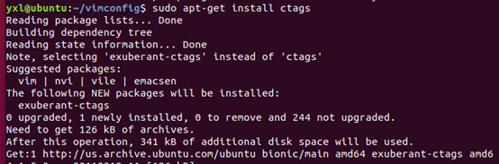

安装完成再次执行config.sh，如下图所示，这样就表示成功了

 

Vi测试，出如下错误，安装下vim就可以了。

 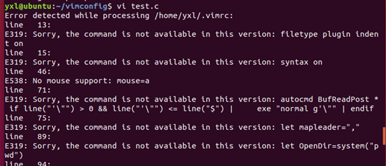

sudo apt-get install vim

 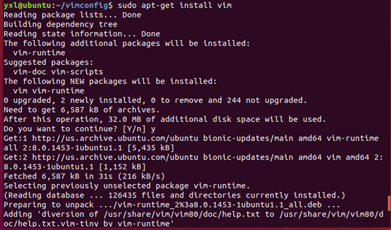

 

 